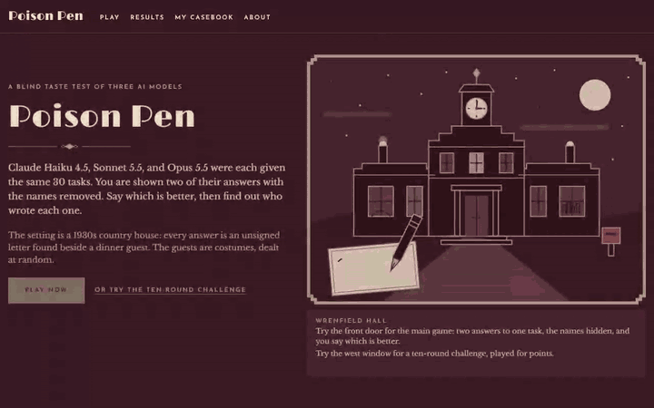

# Poison Pen: A Wrenfield Hall Mystery



Three Claude models (Haiku 4.5, Sonnet 5.5, and Opus 5.5) each answered the same 30 tasks three times, with the same prompt, tools, and limits. That makes 270 recorded answers. Poison Pen turns them into a 1930s country-house mystery. Each answer is an unsigned letter found at dinner, seated beside one of six guests. You decide which letters to trust without knowing who wrote them. Then you see the authors, how each letter scored, and Anthropic's published benchmarks for the same models. Under the game, it is a blind human evaluation with the usual ways of cheating designed out.

**Play it: [agent-eval-arena.vercel.app](https://agent-eval-arena.vercel.app/)**

## How it works

- **Letters are blind.** Before you decide, you see the task and each letter as it was finally written. The server holds back everything else: which model wrote it, how it was written (its steps, tool calls, and what the tools returned), pass or fail, rules met, word count, tokens, cost, all timing, and the models' thinking. Every one of these can identify a model. Haiku takes more steps than the other two, does not think, and runs at a different speed. All of it is shown after your decision.
- **Redaction happens on the server.** The withheld fields never reach the browser, so they cannot be found by reading the page or the network traffic. One TypeScript function does all the redaction. Tests build every round of every mode from the real recordings. They fail if any model name, run id, config, system prompt, or scorer result appears, or if a letter carries anything besides its seat, its guest, and its answer.
- **Guests are costumes, not models.** The guest beside a letter is dealt at random for every round. The function that deals seats is never given the run or its model, so a guest cannot stand for an author. Which letter is shown first is random too. Once there are enough votes, the Official Record reports whether any costume or position is trusted more than chance would explain.
- **Traps.** About one Drawing Room round in eight shows two different runs by the same model on the same task. A player can accuse the table of "one author, two seats". A correct accusation earns points, and a wrong one loses them. Trap rounds never count toward the ranking. They measure how often players see a difference that is not there.
- **Preferences earn no points.** "Which letter is better" has no right answer, so trusting a letter scores nothing. Points come only from answers that can be checked: naming the author (100), calling whether a letter held up to its tests or rules (40), and accusing correctly (+50, or −30 if wrong). Nothing is ever awarded for agreeing with other players. If the crowd's taste were rewarded, players would learn to vote for what they expect others to like.
- **Two rooms.** The Drawing Room is the main game: two letters on one task, trust one or accuse. A Weekend at Wrenfield is a ten-round challenge for points, with three candles: name the model that wrote a letter, spot one model in two seats, and call whether a letter passed its tests or met its rules. Three more rooms (rank three letters, hold or fall, and a daily five) were closed on 2026-10-05 so that a visitor meets one game, not five. The decisions made in them are kept.
- **Only replays, no live calls.** The site reads committed recordings. No model is called while you play, and nothing on the public site can call one.

## Results from the 270 recorded runs

Each model ran the 30-task bank three times on 2026-10-02. Figures are the mean of the three runs, with the lowest and highest run in brackets. Ten tasks (code and agent) have a right answer and are scored pass or fail. The other twenty (writing, diagrams, explanations, tech-stack advice) have no right answer and are scored only on the 101 rules their prompts stated, such as a word limit, a required section, or a diagram that parses.

| Model      | Code and agent tasks passed | Rules met, of 101 | Tokens per run of the bank | Cost per run of the bank, at API rates | Model calls per task |
| ---------- | --------------------------- | ----------------- | -------------------------- | -------------------------------------- | -------------------- |
| Haiku 4.5  | 9 of 10 (9–9)               | 92.3 (85–97)      | 121,129 (117,632–125,961)  | $0.187 ($0.180–$0.197)                 | 1.89                 |
| Sonnet 5.5 | 10 of 10 (10–10)            | 96.3 (94–98)      | 66,507 (66,442–66,540)     | $0.143 ($0.140–$0.145)                 | 1.23                 |
| Opus 5.5   | 10 of 10 (10–10)            | 96.7 (96–98)      | 66,160 (64,684–67,024)     | $0.284 ($0.282–$0.286)                 | 1.22                 |

- **Haiku used 1.8 times the tokens of Sonnet and cost 1.3 times as much at API rates, even though its price per token is half.** It calls tools to check its own work before answering, which the other two rarely do: 170 model calls over 90 runs, against 111 for Sonnet and 110 for Opus. Opus costs twice what Sonnet does for the same number of tokens, because its list price is twice as high. Prices are Anthropic's list prices per million tokens, checked 2026-10-01: Haiku $1 in / $5 out, Sonnet $2 / $10, Opus $4 / $20. Every run was made on a Claude subscription, so the actual cost was $0. All 270 runs together used 761,389 tokens, which comes to $1.84 at API rates.
- **Sonnet and Opus cannot be ranked by this scorer.** Over all runs they score 96.6% and 96.5%. Each moves about two points between identical runs, more than twenty times the gap between them, and the leader changes from run to run.
- **Haiku's only failed task is the same one every time.** It failed `agent-01` in all three runs, once with a wrong answer and twice by running out of its 16,000-token budget. Those two are the only runs of 270 that ended without an answer.

### Run-to-run variance

The same model on the same task, with the same settings, does not always get the same score. This is the noise floor under every comparison on the site.

| Model      | Tasks whose score changed between runs | Mean gap between best and worst run of a task | Whole-bank score, lowest to highest run |
| ---------- | -------------------------------------- | --------------------------------------------- | --------------------------------------- |
| Haiku 4.5  | 9 of 30                                | 9.0 points                                    | 88.0% to 93.7%                          |
| Sonnet 5.5 | 5 of 30                                | 3.2 points                                    | 95.2% to 97.5%                          |
| Opus 5.5   | 4 of 30                                | 3.1 points                                    | 95.8% to 97.5%                          |

All of the movement is on the open-ended tasks. No pass or fail changed in three runs. Haiku's rule-keeping moved by twelve checks between its first and second runs (85 to 97 of 101). One run would have put it clearly behind the other two, and the next one put it level with them. One run is not a measurement.

## Findings

- **A leak found by the test that checks every mode.** In one recorded run, Haiku read a file by its full path. The path contained the name of the harness's working folder, which put the harness's name into a tool call shown before the decision. The redaction now replaces that folder name wherever it appears, and new runs use a neutral folder name. The recordings are not edited. ([DECISIONS.md](docs/DECISIONS.md))
- **The working itself gave Haiku away.** An early version showed each letter's trace before the decision, folded away, with a step count. Because Haiku takes more steps than the others, the count was close to a name tag. The trace and the count now wait for the reveal, and a test checks that a blind letter carries nothing but the guest, the seat, and the answer. ([FINDINGS.md](docs/FINDINGS.md), entry 12)
- **gpt-oss-120b on Groq cannot use a custom code tool.** It was the first choice for an earlier, free-tier version of the project. Given a tool called `python_exec`, it calls its own built-in `python` tool instead, with raw code where JSON arguments belong. Groq rejects every such response. The model repeats the call after being told the tool does not exist, six times in a row in one run, and each rejected call still counts against the rate limit. This happened on all four attempts at the code task, while the same model used the other tools correctly. ([FINDINGS.md](docs/FINDINGS.md), entry 1)
- **The Claude Agent SDK adds context of its own.** With a custom system prompt, every built-in tool removed, and no settings loaded, each request still carried a billing line, an identity line, and three reminder blocks (the environment, the model's own name, and the date). Measured on one captured request, the harness added 767 of its 3,667 characters (21%), roughly 200 tokens per model call. It also sets a 32,000-token output limit and extended thinking on every model by default. The arena caps output at 1,024 tokens and turns thinking off for Haiku. Opus 5.5 and Sonnet 5.5 cannot have thinking turned off, so they run at the lowest effort setting instead. ([FINDINGS.md](docs/FINDINGS.md), entry 5)

### Waiting on votes

These are computed from the players' decisions and will be filled in once there are enough of them. The Official Record shows each one live as soon as it has the votes it needs.

- **Costume bias:** whether a letter is trusted more often beside some guests than others. _Pending: shown after 30 two-letter votes._
- **Position bias:** whether the first letter shown is trusted more often than the second. _Pending: shown after 30 two-letter votes._
- **False differences in trap rounds:** how often players trust one of two letters by the same model instead of calling it a tie or accusing. _Pending: computed from the decision log once there are enough trap rounds._
- **Players against the scorer against the official benchmarks:** whether the ranking from blind votes matches this project's scorer and Anthropic's published results. _Pending: the player ranking appears after 30 votes._

## Run it locally

You need Node 24, pnpm, and Docker. No API key is needed and no model is called. The recordings in `data/recordings/` are the data.

```
pnpm install
cp .env.example .env
pnpm dev:local        # starts Postgres in Docker and the site on http://localhost:3100
```

Tests:

```
pnpm lint && pnpm typecheck
pnpm test             # unit, component, and service tests (TypeScript and Python)
pnpm test:e2e         # plays both rooms in Microsoft Edge against a production build
```

The Postgres store tests run only when `TEST_DATABASE_URL` points at a database (see `apps/web/src/server/store.pg.test.ts`).

### What is in the repository

- `apps/web`: the site (Next.js, TypeScript). Round dealing, redaction, scoring, Elo, and the leaderboard all live here, each in one place.
- `apps/api`: the recorder (Python). It runs the models through the Claude Agent SDK on a subscription and scores the answers. It runs only on the owner's machine and is never deployed.
- `apps/sandbox`: a container with no network access, which runs the hidden tests for code tasks and checks that diagrams parse.
- `tasks/`: the 30 tasks, with their scorers and examples of answers each scorer must accept and reject.
- `data/recordings/`: the 270 recorded runs, scrubbed of credentials.
- Design: [docs/PLAN.md](docs/PLAN.md). Decisions and why: [docs/DECISIONS.md](docs/DECISIONS.md). Everything the runs showed: [docs/FINDINGS.md](docs/FINDINGS.md).

## Known limitations

- **30 tasks, ten of them scored pass or fail.** The pass/fail tasks barely separate the models: three failures in 90 scored runs, all of them Haiku on the same task. Three runs of each task are not independent trials, so intervals pooled over them are narrower than they should be.
- **The rules met are a floor, not a measure of quality.** "Mentions the budget" is a text match, and a diagram is checked for parsing, not for how it looks. Quality on open-ended tasks is what the votes are for.
- **One setting per model.** The models ran through Claude Code's agent loop, capped at 1,024 output tokens per call, with thinking off for Haiku and at the lowest effort for the other two. Results at other settings would differ.
- **The public site only replays.** It cannot run a model, so the 270 letters are all there is.
- **Small vote counts early.** The player ranking and the bias reports stay hidden until 30 votes, and even then their intervals are wide. Votes on a public site can be manipulated. One decision per browser per round, plus rate limits per address, is all that guards them.
- **Not perfectly blind.** Writing style can hint at the author, and the recordings are in this repository. In the Weekend's hold-or-fall rounds, 30 of the 47 letters that fall short are explanation tasks, so the kind of task is itself a clue.
- **Diagram letters are drawn in the browser** with Mermaid, a 440 KB library. On a slow phone, drawing one blocks the page for a second or more when it scrolls into view.

Inspired by golden-age detective fiction.
