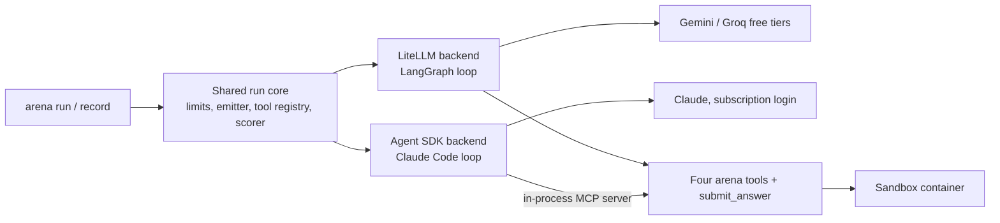

# Claude subscription backend: design proposal

Status: approved by the owner on 2026-10-02, with the changes listed in Section 10. Built as Phase 2b, after Phase 2 (LiteLLM backend) is complete.

## 1. What is being proposed

A second agent backend that runs Claude models through the Claude Agent SDK, authenticated with the owner's Claude subscription login, at no extra charge. It sits beside the LiteLLM backend (Gemini and Groq free tiers) and produces the same trace events, so the scorers, the recordings, and the UI treat both identically.

## 2. What was checked first

### 2.1 Your plan and models

- `claude auth status` on this machine reports a claude.ai login on the **Pro** plan.
- Anthropic's model configuration page says Claude Code on Pro defaults to Opus 5.5, with the aliases `opus` → Opus 5.5, `sonnet` → Sonnet 5.5, and `haiku` → Haiku. It lists no model as unavailable on Pro. Source: https://code.claude.com/docs/en/model-config (checked 2026-10-02).
- Opus 5.5 is confirmed in practice: this Claude Code session is running on it under the same login.
- Sonnet 5.5 and Haiku 4.5 are not yet confirmed by a real call. The SDK's session-start message lists the models the account can use; the pilot reads that list before making any model call and stops if a configured model is missing.

### 2.2 What Anthropic's terms say about this use

Quoted from https://code.claude.com/docs/en/legal-and-compliance (checked 2026-10-02):

- "Advertised usage limits for Pro and Max plans assume ordinary, individual usage of Claude Code and the Agent SDK."
- "OAuth authentication is intended exclusively for purchasers of Claude Free, Pro, Max, Team, and Enterprise subscription plans and is designed to support ordinary use of Claude Code and other native Anthropic applications."
- "Developers building products or services that interact with Claude's capabilities, including those using the Agent SDK, should use API key authentication … Anthropic does not permit third-party developers to offer Claude.ai login into their own applications, or to route requests through Free, Pro, or Max plan credentials on behalf of their users."
- "Anthropic reserves the right to take measures to enforce these restrictions and may do so without prior notice."

And from the consumer terms (https://www.anthropic.com/legal/consumer-terms): users may not access the services "through automated or non-human means, whether through a bot, script, or otherwise", "except when you are accessing our Services via an Anthropic API Key or where we otherwise explicitly permit it".

How the design relates to that:

- **Clearly on the permitted side:** you run the Agent SDK yourself, on your own machine, with your own login. No visitor's request ever reaches your credentials; the public site only plays recordings.
- **A judgment call that is yours to make:** whether a scripted batch of 120 benchmark runs, published as a public demo, is "ordinary, individual usage". The docs do not define that phrase. The design keeps the batch small, sequential, and paced, but it cannot settle the question, and this is not legal advice. If you want certainty, ask Anthropic before the full recording; the pilot is five runs.

### 2.3 A way this could cost money

Pro plans can have **extra usage** enabled, which bills pay-as-you-go once the plan's included usage runs out. The backend cannot see or change that setting. Before any run, turn extra usage off in your claude.ai settings. With it off, hitting the limit makes requests fail, and the recorder stops cleanly.

## 3. Architecture

- A config gains a `backend` field: `litellm` or `agent_sdk`.
- Both backends implement one interface: given a config, a task, and the shared run context, drive the model until it answers or a limit is hit, reporting each model call and tool call to the shared emitter.
- **Shared by both, as one implementation:** the tool functions and their output cap, the sandbox client, the limit accounting, the event emitter and schema validation, the pricing table, the scorers, the run store, and the exporter.
- **Different by necessity:** the loop itself. The LiteLLM backend runs our LangGraph loop; the Agent SDK backend runs Claude Code's loop. This is the confound in Section 8.

### 3.1 Agent SDK configuration

| Setting                                                             | Value                                                                                    | Why                                                                                                                                |
| ------------------------------------------------------------------- | ---------------------------------------------------------------------------------------- | ---------------------------------------------------------------------------------------------------------------------------------- |
| `system_prompt`                                                     | The config's prompt, as a plain string                                                   | Docs: with a custom string "the SDK sends only what you provide"                                                                   |
| `tools`                                                             | `[]`                                                                                     | Removes every built-in tool from the model's context                                                                               |
| `mcp_servers`                                                       | One in-process server, `arena`, exposing the config's enabled tools plus `submit_answer` | Same Python functions the LiteLLM backend calls                                                                                    |
| `allowed_tools`                                                     | `mcp__arena__*`                                                                          | Runs our tools without a permission prompt                                                                                         |
| `setting_sources`                                                   | `[]`                                                                                     | No `CLAUDE.md`, user settings, skills, hooks, or `apiKeyHelper` are loaded                                                         |
| `ENABLE_TOOL_SEARCH`                                                | `false`                                                                                  | Tool search is on by default and would defer our tool schemas behind an extra `ToolSearch` call; off loads all definitions upfront |
| `CLAUDE_CODE_DISABLE_ATTACHMENTS`, `CLAUDE_CODE_DISABLE_CLAUDE_MDS` | `1`                                                                                      | Stops the harness adding skill lists, task nudges, and project files to the conversation                                           |
| `model`                                                             | `claude-opus-5-5`, `claude-sonnet-5-5`, or `claude-haiku-4-5`                            | Full names, not aliases, so a recording pins the model                                                                             |
| `max_turns`                                                         | A backstop above `max_steps`                                                             | The real step limit is enforced by our own counter, identically for both backends                                                  |
| `include_partial_messages`                                          | `True`                                                                                   | The only way to get true per-call output tokens and timing; per-message output counts are documented as placeholders               |
| Effort and thinking                                                 | Not set                                                                                  | Same rule as the other configs: provider defaults, no overrides                                                                    |

### 3.2 Proving that a call contains only the prompt and the tools

"Only my prompt and the four arena tools" is a claim to verify, not assume. Two checks are part of the build:

1. **Session-start check, every run.** The SDK's first message lists the tools in the session. The backend aborts before any model call unless that list is exactly the arena tools.
2. **Raw request inspection, once during development and once in the pilot.** Claude Code can write each request body to a directory (`OTEL_LOG_RAW_API_BODIES`). I will capture one run, list everything in the request that is not our prompt, our tools, or the conversation, and report it to you. The capture directory is outside the repo and is deleted afterwards.

Known differences I expect that check to show, and cannot remove:

- Tools reach the model as `mcp__arena__calculator` and so on. The trace stores the plain name; the model sees the prefixed one.
- The API adds its own tool-use preamble for Claude models (a few hundred tokens, per Anthropic's pricing page).
- Claude Code may add a short identity or billing line of its own to the system prompt on subscription logins. If it does, I will show you the exact text.

### 3.3 Same limits as the LiteLLM backend

| Limit               | How it is enforced on this backend                                                                                    |
| ------------------- | --------------------------------------------------------------------------------------------------------------------- |
| `max_steps`         | Our counter of distinct model responses; the session is interrupted when it is reached                                |
| Token cap per run   | Our counter, updated after every response from provider-reported usage; the session is interrupted when it is reached |
| Tool-output cap     | Inside the shared tool functions, so it is identical by construction                                                  |
| Active-time timeout | The shared run timer                                                                                                  |
| Answer extraction   | `submit_answer` ends the run immediately; a final text reply with no tool call is also accepted                       |

One accounting difference to know about: the Agent SDK uses prompt caching automatically, so input tokens arrive split into uncached, cache-write, and cache-read. The trace records the total as `prompt_tokens` and keeps the split, and the reference cost applies Anthropic's published cache rates. The Gemini and Groq calls have no such split.

### 3.4 Same trace events

| Agent SDK stream                     | Trace event                                          |
| ------------------------------------ | ---------------------------------------------------- |
| Session start                        | `run_started` (config snapshot, including `backend`) |
| First block of a new model response  | `step_started`                                       |
| Completed model response, with usage | `llm_call`                                           |
| Our tool handler entered             | `tool_call`                                          |
| Our tool handler returned            | `tool_result`                                        |
| Response and its tools finished      | `step_finished`                                      |
| Session result, or our interrupt     | `run_finished`, then `score_computed`                |
| API or SDK error                     | `error`                                              |

Tool calls and results are emitted from our own handlers, so their arguments, output, and timing are exact. Every event passes the same schema validation.

Schema changes needed (in addition to `reference_cost_usd` from the last revision): `backend` on the config snapshot, and nullable `cache_read_tokens` and `cache_write_tokens` on `llm_call`, both redacted in the blind view.

## 4. Configs

| Config                      | Model               | Prompt                           | Tools    |
| --------------------------- | ------------------- | -------------------------------- | -------- |
| `claude-opus-full`          | `claude-opus-5-5`   | Full agent prompt                | All four |
| `claude-sonnet-full`        | `claude-sonnet-5-5` | Full agent prompt                | All four |
| `claude-haiku-full`         | `claude-haiku-4-5`  | Full agent prompt                | All four |
| `claude-sonnet-bare-prompt` | `claude-sonnet-5-5` | One line: "Answer the question." | All four |

- **Controlled pair:** `claude-sonnet-full` and `claude-sonnet-bare-prompt` differ only in the prompt.
- **Model ladder:** the three `-full` configs differ only in the model.
- **Prompts** are the same two texts the Gemini and Groq configs use.
- Model names are from https://platform.claude.com/docs/en/about-claude/models/overview (checked 2026-10-01). That page lists Haiku 4.5's retirement as "not sooner than October 15, 2026", so Haiku is recorded first.

## 5. Cost and the guard

The pricing table's `free_tier` flag becomes a `billing` field with three values:

| `billing`      | Meaning                                                | May run?                             |
| -------------- | ------------------------------------------------------ | ------------------------------------ |
| `free`         | Free API tier (Gemini, Groq)                           | Yes                                  |
| `subscription` | Claude through the Agent SDK on the subscription login | Yes, on the `agent_sdk` backend only |
| `paid`         | Anything billed per token                              | No, unless explicitly overridden     |

- A Claude model requested through the LiteLLM backend is `paid` and is refused. There is no code path that sends a Claude request with an API key.
- Actual cost is recorded as $0. Reference cost uses Anthropic's API prices per million tokens, from https://platform.claude.com/docs/en/about-claude/pricing (checked 2026-10-01):

| Model             | Input | Output | Cache read | Cache write (5 min / 1 hour) |
| ----------------- | ----- | ------ | ---------- | ---------------------------- |
| Claude Opus 5.5   | $4    | $20    | $0.20      | $5 / $8                      |
| Claude Sonnet 5.5 | $2    | $10    | $0.20      | $2.50 / $4                   |
| Claude Haiku 4.5  | $1    | $5     | $0.10      | $1.25 / $2                   |

- The reference cost is computed from our table, not taken from the SDK's `total_cost_usd`, which the docs call a "client-side estimate". The pilot report shows both so any disagreement is visible.

## 6. Security

### 6.1 Where it runs and how credentials get there

The backend runs **inside the `api` container**, because the arena tools call the sandbox over an internal Docker network that the host cannot reach.

- You run `claude setup-token` on the host. It prints a one-year token that, per the docs, "can only make model requests". You put it in `.env` as `CLAUDE_CODE_OAUTH_TOKEN`.
- `.env` is git-ignored and excluded from the Docker build context, so the token is in neither the repo nor any image. Compose passes it to the `api` container as an environment variable at start.
- Your `~/.claude` directory and its `.credentials.json` are never mounted or copied.
- The `sandbox` container does not receive `.env`, so code the agent runs cannot read the token.

### 6.2 Never falling back to paid billing

Claude Code prefers an API key over a subscription token when both exist. The backend therefore refuses to start a Claude run unless all of these hold:

1. `CLAUDE_CODE_OAUTH_TOKEN` is set.
2. None of `ANTHROPIC_API_KEY`, `ANTHROPIC_AUTH_TOKEN`, `ANTHROPIC_BASE_URL`, `ANTHROPIC_PROFILE`, `CLAUDE_CODE_USE_BEDROCK`, `CLAUDE_CODE_USE_VERTEX`, or `CLAUDE_CODE_USE_FOUNDRY` is set. Each of them outranks the subscription token.
3. `setting_sources` is empty, so no settings file can supply an `apiKeyHelper`.
4. The session-start message reports a subscription account and no API-key source. If it reports anything else, the run aborts before the first model call.

Any failure is a clear error naming the cause. There is no fallback.

### 6.3 Keeping credentials out of everything written

- A scrubber runs before anything is persisted (trace payloads, stored messages, logs) and again at export. It removes the values of every secret environment variable and anything matching Claude token formats.
- The secret-scan test, which already covers `data/recordings/`, is extended with: `sk-ant-oat…` and `sk-ant-ort…` (OAuth access and refresh tokens), `sk-ant-api…`, the keys `claudeAiOauth`, `accessToken`, and `refreshToken`, and any file named `.credentials.json` anywhere in the repo.
- `.gitignore` gains `.credentials.json`.
- The backend never logs its environment or the SDK's start-up arguments.

### 6.4 Local only

The Python backend is not deployed anywhere, and the public site has no route that reaches it. A test asserts that the web app's production build contains no reference to the Agent SDK or to `CLAUDE_CODE_OAUTH_TOKEN`.

## 7. Pilot and recording

**Pilot (5 runs):** one run of each Claude config plus one extra Opus run, on development tasks from Phase 2 (the 30-task bank is Phase 3). Report per run: input tokens (with the cache split), output tokens, steps, wall time, active time, reference cost from our table, and the SDK's own estimate. Then stop, so you can read your usage at claude.ai.

**Full recording, only after you approve:**

- Order: all Haiku runs first, then Sonnet, then Opus.
- Sequential, one run at a time, never in parallel.
- Resumable: a `(config, task)` pair is done when a finished run exists; re-running skips it.
- On a usage-limit error the recorder abandons the run in progress (never recording it as an agent failure), prints the reset time if the API reported one, and exits. The same command resumes later.

**Something to expect:** Pro limits are shared with your everyday Claude Code use, including sessions like this one. Recording will eat into that allowance, and Opus runs most of all. The pilot measures how much.

## 8. The confound, and a question about matches

Claude configs run Claude Code's agent loop; Gemini and Groq configs run ours. A cross-family difference could therefore come from the model or from the loop. Within a family, every config shares one loop, so those comparisons are clean. This goes on `/about` and in `DECISIONS.md`.

With eight configs there are 28 possible pairs, so 840 replay matches for 30 tasks, and votes would be spread thin. My recommendation:

- Build matches **only within a backend**: 6 Claude pairs and 6 free-tier pairs, so 360 matches.
- Show **one Elo board per backend**. The objective leaderboard can show all eight side by side, with the confound noted.

That keeps the confound out of the human-preference ratings entirely. The alternative is to build all 840 and mark cross-backend results as confounded.

## 9. Answers from the owner (2026-10-02)

1. Phase 2 is approved, including the five consequences of free hosting. Build order: Phase 2 with the LiteLLM backend only, with a shared core a second loop can plug into; report and stop; then this backend as Phase 2b.
2. This design is approved as written.
3. Matches only within a backend (360 matches), one Elo board per backend. The objective leaderboard shows all eight configs together with the loop confound noted.
4. The owner is comfortable with the pilot and will decide on the full recording after seeing its numbers. Extra usage has been turned off on the account.

## 10. Changes to this design made at approval

- **Section 7, pilot.** Phase 2b ends with a single smoke run that confirms subscription auth, the custom prompt, and the tool setup, and shows the owner the captured raw request. The five-run usage pilot moves to after Phase 3, on real tasks from the bank, so its numbers are representative.
- **One implementation per piece of logic.** Elo, confidence intervals, the agreement stat, and blind-view redaction exist only in TypeScript. Python does not compute them.

## 11. What the build and the smoke test showed (2026-10-02)

Built as `apps/api/src/arena/backends/agent_sdk.py` and `claude_auth.py`, with Claude Agent SDK 0.2.163 and its bundled Claude Code 2.1.286.

**Smoke run.** `claude-haiku-full` on `dev-math-01`: answered 313.03 (correct) in 3 steps, 5,477 input and 545 output tokens, 6.1 seconds active, 7.8 seconds wall clock. Actual cost $0; reference cost $0.008202, which matches the SDK's own estimate to the last digit.

**Confirmed.**

- The session reports `apiKeySource: "none"`, which is what a subscription login looks like. Any other value aborts the run before a model call.
- The session's tools were exactly the arena's five (four tools and `submit_answer`), all prefixed `mcp__arena__`. No built-in tool was present.
- A `PostToolUse` hook ends the session with no further model call once the run has stopped. Submitting an answer costs no extra request.
- The usage status reported with each response includes whether extra usage would be accepted. It read `rejected`, meaning extra usage is off. The backend now refuses to continue if it ever reads `allowed`.

**Request settings were then brought in line with the other configs** (owner's instruction, same day). Verified with a fresh captured request per model:

| Model               | `max_tokens` | Thinking                                                                       | How                                                      |
| ------------------- | ------------ | ------------------------------------------------------------------------------ | -------------------------------------------------------- |
| `claude-haiku-4-5`  | 1,024        | Off: `thinking: {"type": "disabled"}`                                          | `CLAUDE_CODE_MAX_OUTPUT_TOKENS`, `MAX_THINKING_TOKENS=0` |
| `claude-sonnet-5-5` | 1,024        | Cannot be turned off. No `thinking` field is sent; effort is `low`, the lowest | `CLAUDE_CODE_EFFORT_LEVEL=low`                           |
| `claude-opus-5-5`   | 1,024        | Cannot be turned off. No `thinking` field is sent; effort is `low`, the lowest | `CLAUDE_CODE_EFFORT_LEVEL=low`                           |

All three models answered `dev-math-01` correctly under these settings, which also confirms that the Pro plan can use Opus 5.5, Sonnet 5.5, and Haiku 4.5 through this backend.

**What is still different after that change.**

1. **Opus 5.5 and Sonnet 5.5 still think.** Anthropic does not allow thinking to be disabled on them. They run at the lowest effort. Haiku 4.5 does not think.
2. **Two system-prompt blocks and three reminder blocks are added** (table below). No setting removes them on a subscription login.
3. **Each request carries about 1,450 input tokens of fixed overhead** (the tool-use preamble, five tool schemas, and the added blocks).
4. **Prompt caching is on**, with a one-hour lifetime. The first request of a run can be priced, at reference rates, as a cache write.
5. **Tools are named `mcp__arena__<name>`** in the request.
6. **The trace's input preview shows our system prompt and the task**, not the added blocks.

The captured requests are in `docs/findings/claude-agent-sdk-request/`, one per model.

**What each request contains besides our prompt and tools.**

| Where                  | What Claude Code adds                                                                                                                                                                                                                                       |
| ---------------------- | ----------------------------------------------------------------------------------------------------------------------------------------------------------------------------------------------------------------------------------------------------------- |
| System prompt, block 1 | A billing header line: `x-anthropic-billing-header: cc_version=…; cc_entrypoint=sdk-py; …`                                                                                                                                                                  |
| System prompt, block 2 | "You are a Claude agent, built on Anthropic's Claude Agent SDK."                                                                                                                                                                                            |
| System prompt, block 3 | Our prompt, unchanged                                                                                                                                                                                                                                       |
| First user message     | Three `<system-reminder>` blocks before the task: the environment (working directory, platform, OS version), the model's name and knowledge cutoff, and today's date                                                                                        |
| Tools                  | Ours only, named `mcp__arena__<name>`                                                                                                                                                                                                                       |
| Request settings       | As first observed: `max_tokens: 32000` and extended thinking with a 31,999-token budget. Both are now overridden (table above). Still set by Claude Code: prompt caching with a one-hour lifetime, and a context-management rule that keeps thinking blocks |

`CLAUDE_CODE_DISABLE_ATTACHMENTS` did not remove the three reminders. The only mode that drops them does not accept a subscription token.

**Tool timing.** Claude Code can start a tool before the model response has finished streaming. The backend holds each tool, in the `PreToolUse` hook, until that response is recorded, so trace events stay in order.

**Subscription usage for this phase.** Twelve requests in total: a probe of the SDK's event order (two Haiku requests), the smoke run (three Haiku), and one verification run per model after the settings change (four Haiku, two Sonnet, one Opus).
