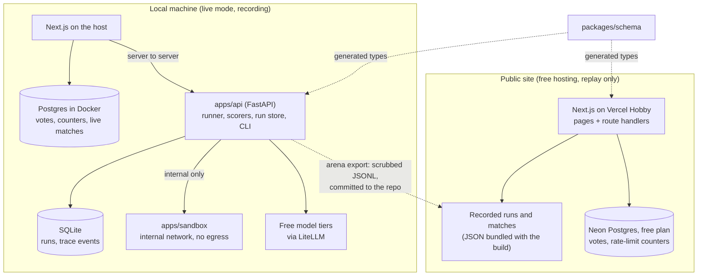
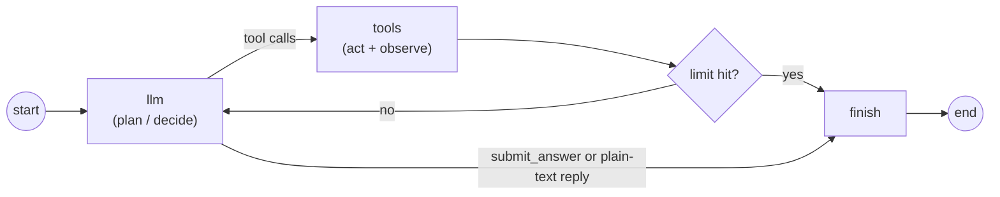
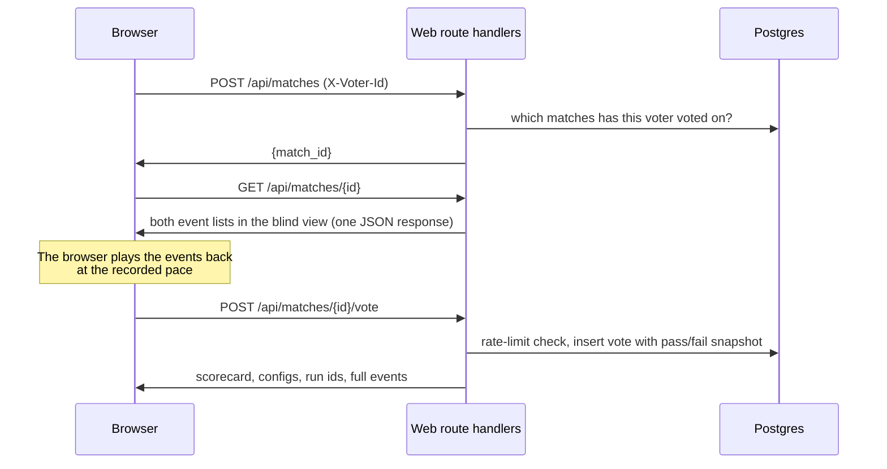

# Agent Eval Arena: Plan

Status: revised 2026-10-02 for the zero-cost constraint and approved the same day. Phase 1 complete, Phase 2 in progress.

A second agent backend for Claude models on the owner's subscription is designed in `CLAUDE_BACKEND.md` and built as Phase 2b. Where this plan says four configs, 120 runs, or 180 matches, the totals with that backend are eight configs, 240 runs, and 360 matches (matches are built only within a backend, with one Elo board per backend).

This plan turns the project brief into a buildable design. Where it departs from the brief, the departure is listed in [Section 12](#12-deviations-from-the-brief) and the reason is in `DECISIONS.md`. Questions raised along the way and their answers are in [Section 13](#13-resolved-questions).

## 1. What we're building

A web app where a visitor picks a task, watches two agent configs solve it side by side as structured trace events play out, votes blind on which did better, and then sees the scorecard. Votes feed an Elo leaderboard shown next to an objective-metrics leaderboard, with an agreement stat that says how often human preference matches the scorer.

Priorities, in order: correct trace data, honest scoring, reproducibility, then visual polish.

**Hard constraint: the project costs $0.** No paid API usage and no paid hosting. Agents run only on free model tiers, the public site runs on free hosting, and the runner refuses any model not marked free unless the owner explicitly overrides it.

## 2. Architecture

There are two deployments of the same web app. The public one has no Python backend.

### 2.1 Who owns what

| Concern                                                                    | Owner                                     | Runs where             |
| -------------------------------------------------------------------------- | ----------------------------------------- | ---------------------- |
| Agent loop, tools, sandbox, scorers                                        | Python (`apps/api`, `apps/sandbox`)       | Local only             |
| Run store (runs, trace events, conversation)                               | Python, SQLite through SQLAlchemy         | Local only             |
| Recording, throttling, export                                              | Python CLI (`arena`)                      | Local only             |
| Blind-view redaction, matches, votes, rate limits, leaderboards, agreement | TypeScript (`apps/web` route handlers)    | Local and public       |
| Recorded runs and replay matches                                           | JSON files in `data/recordings/`          | Bundled with the build |
| Votes and rate-limit counters                                              | Postgres (Docker locally, Neon in public) | Local and public       |

Each piece of logic exists once. Redaction, voting, Elo, and agreement are written in TypeScript because the public site has no Python; the Python API never serves a browser directly.

### 2.2 Components

| Component          | Responsibility                                                                                                    |
| ------------------ | ----------------------------------------------------------------------------------------------------------------- |
| `apps/web`         | UI, plus route handlers for matches, blind view, votes, leaderboards. Proxies live runs to `apps/api`.            |
| `apps/api`         | Runner, scorers, run store, live-run SSE, `arena` CLI. Reachable only from the web server, locally.               |
| `apps/sandbox`     | Executes Python for `python_exec` and `python_check`, and checks that a Mermaid diagram parses. Holds no secrets. |
| `packages/schema`  | Single JSON Schema for trace events; generates TS types and Pydantic models.                                      |
| `tasks/`           | Task bank (YAML), CSV fixtures, doc corpus, checker functions. YAML is the source of truth.                       |
| `data/recordings/` | Exported recorded runs, replay matches, and a run index. Scrubbed, committed.                                     |

### 2.3 Sandbox isolation

Built and verified in Phase 1. The sandbox is a separate container:

- Attached only to `sandbox_net` (`internal: true`): no route to the internet, no published ports. The API is the only other member.
- Read-only root filesystem, `tmpfs` for `/tmp`, all capabilities dropped, `no-new-privileges`, non-root user, memory, PID, and CPU limits.
- Each execution is a fresh subprocess in a fresh temp directory with `RLIMIT_AS`, `RLIMIT_CPU`, `RLIMIT_NPROC`, `RLIMIT_FSIZE`, and a hard wall-clock kill.
- Task fixtures are mounted read-only. The container has no API keys and no database credentials.
- Output is truncated at a fixed byte limit before it returns to the API.
- The image also carries Node 22 with `mermaid` 12.0.0 and `jsdom` 30.1.1, pinned by a lockfile and installed at build time. `POST /mermaid/parse` runs the real Mermaid parser on a diagram under the same subprocess limits and returns whether it parsed. Nothing is drawn. The answer is passed as data, never as code.

The Docker socket is never mounted anywhere.

### 2.4 Agent loop

A plain LangGraph `StateGraph`. Nodes call LiteLLM directly; no LangChain chat-model adapter.

- **Answer extraction.** A control tool `submit_answer(answer: string)` is always available and is not part of `enabled_tools`. A plain-text reply with no tool call is also accepted as the final answer. Tool choice is never forced.
- **Limits.** `max_steps` (config), `max_total_tokens`, `max_cost_usd`, and a timeout on active time. Each ends the run cleanly with its own `stop_reason`, and the run is then scored as normal.
- **Small contexts.** Free tiers cap tokens per minute (8,000 on Groq), so tool output returned to the model is truncated to 2,000 characters, a completion is capped at 1,024 tokens, and a run at 16,000 tokens. These were set from the first real runs, where single requests stayed under 1,600 prompt tokens. The same limits apply to every config.
- **Conversation store.** The conversation is append-only in `run_messages`, keeping each provider message verbatim, including reasoning fields that providers require to be passed back unchanged.
- **Temperature.** Nullable. When null the parameter is omitted from the request.

### 2.5 Free-only guard

- Every model the runner may call has an entry in the pricing table (`apps/api`), with a `free_tier` flag, the free tier's rate limits, the paid list price for reference, the source URL, and the date checked.
- Before any model call, the runner checks the entry. A model with no entry, or one not marked `free_tier`, is refused with a clear error. The only bypass is an explicit override (`--allow-paid` on the CLI or `ARENA_ALLOW_PAID_MODELS=1`), which is off by default and logged when used.
- The guard checks the model, not the account. A Gemini key from a Google Cloud project with billing enabled, or a Groq account upgraded to a paid plan, is billed for the same model string. The setup instructions therefore say: create the Gemini key in a project without billing, and keep the Groq account on the free plan.

### 2.6 Cost fields

Actual cost is $0 on free tiers, but cost is still worth comparing. Every `llm_call` records two numbers:

- `cost_usd`: what was actually charged. $0 for free-tier calls.
- `reference_cost_usd`: what the same tokens would cost at the provider's paid list price, from the pricing table.

The scorecard and leaderboards show both, labelled "actual" and "at paid rates". Pass-per-dollar uses the paid-rate figure.

### 2.7 Timing under rate limits

Throttling and backoff waits are an artefact of the free tier, not of the agent, so they must not leak into the metrics:

- `latency_ms` on a run is active time: the sum of model-call and tool-call latencies. Wall-clock time is stored separately.
- The run timeout counts active time only.
- Replays are paced from per-call latencies, so a recorded run that waited ten minutes for quota replays at the speed the agent actually worked.
- A run interrupted by rate limiting is abandoned and re-run from the start. It is never recorded as an agent failure and never exported.

## 3. Data model

### 3.1 Local run store (SQLite, SQLAlchemy, Alembic)

All ids are ULIDs stored as text. All timestamps are UTC.

**`configs`** (immutable; an edit inserts a new row)

| Field           | Type            | Notes                                                          |
| --------------- | --------------- | -------------------------------------------------------------- |
| `id`            | text PK         | One row per version                                            |
| `family_id`     | text            | Stable across versions of the same config                      |
| `version`       | int             | Unique with `family_id`                                        |
| `display_name`  | text            |                                                                |
| `model`         | text            | LiteLLM model string                                           |
| `provider`      | text            |                                                                |
| `model_family`  | text            | Lineage-level, e.g. `gemini`; used by the judge-exclusion rule |
| `system_prompt` | text            |                                                                |
| `enabled_tools` | JSON            | Subset of the four tools                                       |
| `max_steps`     | int             |                                                                |
| `temperature`   | float, nullable | Omitted from requests when null                                |
| `created_at`    | timestamp       |                                                                |

**`tasks`** (synced from YAML; never edited through the API)

| Field                                       | Type    | Notes                                                                                                                          |
| ------------------------------------------- | ------- | ------------------------------------------------------------------------------------------------------------------------------ |
| `id`                                        | text PK | Slug from the YAML file                                                                                                        |
| `title`, `category`, `prompt`, `difficulty` | text    | Category is one of `writing`, `diagram`, `explanation`, `tech_stack`, `code`, `agent`                                          |
| `scorer_type`                               | text    | `exact`, `numeric_tolerance`, `regex`, `python_check`, `constraints`, `llm_judge`                                              |
| `scorer_config`                             | JSON    | Expected answer, tolerance, pattern, checker reference, hidden test cases, constraint list, or rubric. Never sent to a browser |
| `required_tools`                            | JSON    | Tools the task needs                                                                                                           |
| `content_hash`                              | text    | Hash of the YAML; stamped onto each run                                                                                        |

**`runs`**

| Field                                                | Type           | Notes                                                                                       |
| ---------------------------------------------------- | -------------- | ------------------------------------------------------------------------------------------- |
| `id`                                                 | text PK        |                                                                                             |
| `config_id`, `task_id`, `task_hash`                  |                |                                                                                             |
| `source`                                             | text           | `recording` or `live`                                                                       |
| `status`                                             | text           | `pending`, `running`, `finished`, `failed`, `abandoned`                                     |
| `stop_reason`                                        | text, nullable | Section 4                                                                                   |
| `final_answer`                                       | text, nullable |                                                                                             |
| `passed`, `score`, `score_explanation`               |                | `passed` is null for constraint-scored tasks (Section 7.2)                                  |
| `checks`                                             | JSON           | The constraint checks, each with a name, a verdict, and a detail. Empty for pass/fail tasks |
| `answer_words`                                       | int            | Word count of the final answer, counted once, in Python, when the run finishes              |
| `prompt_tokens`, `completion_tokens`, `total_tokens` | int            | Provider-reported                                                                           |
| `cost_usd`                                           | numeric        | Actually charged                                                                            |
| `reference_cost_usd`                                 | numeric        | At paid list price                                                                          |
| `steps`, `tool_calls`                                | int            |                                                                                             |
| `latency_ms`                                         | int            | Active time                                                                                 |
| `wall_clock_ms`                                      | int            | Including throttle waits                                                                    |
| `started_at`, `finished_at`                          | timestamp      |                                                                                             |

**`trace_events`**: `run_id`, `seq` (unique with `run_id`, strictly increasing, no gaps), `type`, `timestamp`, `payload` (validated against the schema before insert). `side` is not stored; it belongs to the match.

**`run_messages`**: `run_id`, `idx`, `role`, `content` (the provider message, verbatim). An `llm_call` event stores `input_upto` plus a truncated preview of the messages added since the previous call; the full input is rebuilt on demand. This avoids a full copy of the conversation per call, which grows quadratically.

### 3.2 Exported files (`data/recordings/`, committed)

| File              | Contents                                                                                             |
| ----------------- | ---------------------------------------------------------------------------------------------------- |
| `runs/*.jsonl`    | One file per recorded run: the config snapshot, the task id and hash, metrics, score, and all events |
| `runs-index.json` | One row per run with its metrics and pass/fail, for the leaderboards                                 |
| `matches.json`    | The 360 replay matches: id, task, left and right run ids. Side assignment is randomised once, seeded |
| `tasks.json`      | Public task fields only (title, category, prompt, difficulty). No expected answers                   |

A match references two runs and does not own them. With eight configs in two backend groups of four, 240 recorded runs (8 configs × 30 tasks) make 360 replay matches (6 config pairs × 30 tasks × 2 groups); matches stay within a group.

### 3.3 Postgres (Docker locally, Neon free plan in public)

**`votes`**

| Field                                     | Type           | Notes                                                                                   |
| ----------------------------------------- | -------------- | --------------------------------------------------------------------------------------- |
| `id`                                      | bigserial      | Monotonic; tiebreak for Elo ordering                                                    |
| `match_id`                                | text           | Unique with `voter_id`                                                                  |
| `voter_id`                                | text           | Anonymous id generated by the browser                                                   |
| `ip_hash`                                 | text           | Keyed hash of the IP; the raw IP is never stored                                        |
| `choice`                                  | text           | `left`, `right`, `tie`, `both_bad`                                                      |
| `left_config_id`, `right_config_id`       | text           | Denormalised so the vote log is self-contained                                          |
| `left_passed`, `right_passed`             | bool, nullable | Snapshot of both scorer results, stored on every vote. Null for constraint-scored tasks |
| `left_answer_words`, `right_answer_words` | int            | Snapshot of both answer lengths, for the length-bias stat                               |
| `task_category`                           | text           | For category filters without a join                                                     |
| `created_at`                              | timestamp      |                                                                                         |

**`rate_limit_counters`**: `bucket` (`scope:ip_hash`), `window_start`, `count`. Fixed windows, incremented with one atomic `INSERT … ON CONFLICT DO UPDATE … RETURNING count`. Counters live in the database so they survive restarts and are shared across serverless instances.

**`live_matches`** (used locally only): `id`, `task_id`, `left_run_id`, `right_run_id`, `created_at`.

The public database holds only votes and counters, a few kilobytes per thousand votes, far inside Neon's free allowance.

## 4. Trace event schema

Defined once in `packages/schema/trace-event.schema.json` (JSON Schema 2020-12, discriminated on `type`). Built in Phase 1.

Envelope: `run_id`, `side` (`left`, `right`, or null on run permalinks), `seq`, `type`, `timestamp`, `redacted`, `payload`.

| Type             | Payload                                                                                                                                  |
| ---------------- | ---------------------------------------------------------------------------------------------------------------------------------------- |
| `run_started`    | `config` snapshot, `task_id`                                                                                                             |
| `step_started`   | `step`                                                                                                                                   |
| `llm_call`       | `model`, `input_upto`, `input_preview[]`, `output`, `prompt_tokens`, `completion_tokens`, `cost_usd`, `reference_cost_usd`, `latency_ms` |
| `tool_call`      | `call_id`, `tool`, `arguments`                                                                                                           |
| `tool_result`    | `call_id`, `output` (truncated), `truncated`, `success`, `latency_ms`, `error`                                                           |
| `step_finished`  | `step`, cumulative `total_tokens`, `cost_usd`, `reference_cost_usd`                                                                      |
| `run_finished`   | `final_answer`, `cost_usd`, `reference_cost_usd`, `total_tokens`, `steps`, `latency_ms`, `stop_reason`                                   |
| `score_computed` | `passed` (null for constraint-scored tasks), `score`, `scorer_type`, `explanation`, `checks[]` (`name`, `passed`, `detail`)              |
| `error`          | `message`, `recoverable`                                                                                                                 |

`stop_reason` is one of `answered`, `max_steps`, `max_tokens`, `max_cost`, `timeout`, `error`.

`reference_cost_usd` is new in this revision and is added to the schema at the start of Phase 2.

**Generation.** `json-schema-to-typescript` writes `packages/schema/generated/trace-event.ts`. `datamodel-code-generator` writes `apps/api/src/arena/schema_gen.py`. Both outputs are committed. `pnpm schema:check` fails on any drift and runs in lint.

### 4.1 Blind view

Before the vote, a voter sees only what each agent did and what it answered: the traces and the final answers, with a counter strip showing step count and elapsed time. Pass/fail, score, cost, tokens, and config names are revealed together after the vote. If the result were visible first, voters would pick the side that passed and the agreement stat would be circular.

Redaction happens on the server, in the web app's route handlers. Until the requesting voter has voted on a match, everything served for that match is filtered, and each filtered event carries `redacted: true`:

| Event            | Before the vote                                                                                                                        |
| ---------------- | -------------------------------------------------------------------------------------------------------------------------------------- |
| every event      | `run_id` replaced by a match-scoped alias                                                                                              |
| `run_started`    | `config` is null                                                                                                                       |
| `llm_call`       | `model`, `prompt_tokens`, `completion_tokens`, `cost_usd`, `reference_cost_usd` are null; system messages removed from `input_preview` |
| `step_finished`  | `total_tokens`, `cost_usd`, `reference_cost_usd` are null                                                                              |
| `run_finished`   | `cost_usd`, `reference_cost_usd`, `total_tokens` are null; `stop_reason` is null when it is `max_tokens` or `max_cost`                 |
| `score_computed` | not sent at all                                                                                                                        |

Still visible: step numbers, tool calls and results, model output, the final answer, latencies, and `error` events.

The constraint checks travel in `score_computed`, so they are withheld with it. Answer length is not hidden and cannot be: the voter reads the answer.

The schema marks every redactable field as nullable, so the blind view is valid against the same schema.

## 5. API

### 5.1 Web route handlers (`apps/web`, local and public)

Requests carry `X-Voter-Id`, an anonymous UUID the browser generates and keeps in local storage. No cookies.

| Method and path                              | Request                                                                                | Response                                                                                                                                                                                         |
| -------------------------------------------- | -------------------------------------------------------------------------------------- | ------------------------------------------------------------------------------------------------------------------------------------------------------------------------------------------------ |
| `GET /api/meta`                              |                                                                                        | `{live_available, categories}`                                                                                                                                                                   |
| `GET /api/tasks?category=`                   |                                                                                        | Public task fields                                                                                                                                                                               |
| `GET /api/configs`                           |                                                                                        | Configs seen in recordings (and local configs when live is available)                                                                                                                            |
| `POST /api/matches`                          | `{task_id \| "random", left_config_id \| "random", right_config_id \| "random", mode}` | `{match_id, mode}`. Replay picks an existing match the voter has not voted on. Live (local only) starts two runs through the Python API                                                          |
| `GET /api/matches/{id}`                      |                                                                                        | Task, `voted`, and per side: status, steps, elapsed time, final answer, and the event list in the blind view. After the vote: full events, scorecard, configs, run ids, tallies                  |
| `GET /api/matches/{id}/events`               | `Last-Event-ID`                                                                        | Live matches only: SSE proxied from the Python API, redacted per event                                                                                                                           |
| `POST /api/matches/{id}/vote`                | `{choice}`                                                                             | `201 {reveal, scorecard, tallies}`; `409` if already voted or unfinished; `429` if rate limited                                                                                                  |
| `GET /api/runs/{id}`                         |                                                                                        | Run, config, metrics, score, events (unblinded permalink)                                                                                                                                        |
| `GET /api/leaderboard/preference?category=`  |                                                                                        | `[{config, elo, ci_low, ci_high, votes, wins, losses, ties}]`                                                                                                                                    |
| `GET /api/leaderboard/objective?category=`   |                                                                                        | `[{config, runs, scored_runs, pass_rate, pass_ci, constraint_runs, constraints_met_rate, mean_answer_words, mean_reference_cost_usd, mean_steps, mean_latency_ms, passes_per_reference_dollar}]` |
| `GET /api/leaderboard/agreement?category=`   |                                                                                        | `{decisive_votes, agreement_rate, ci, table, left_pick_rate}`. Code and agent tasks only                                                                                                         |
| `GET /api/leaderboard/length-bias?category=` |                                                                                        | `{votes, longer_pick_rate, ci, by_category}`. Open-ended tasks only                                                                                                                              |

Run ids are returned only after the voter has voted.

### 5.2 Python API (`apps/api`, local only, called by the web server)

| Method and path                         | Purpose                                                         |
| --------------------------------------- | --------------------------------------------------------------- |
| `GET /api/health`                       | Liveness and sandbox reachability                               |
| `GET /api/configs`, `POST /api/configs` | List configs; create a new immutable version                    |
| `GET /api/tasks`                        | Task list                                                       |
| `POST /api/runs`                        | Start a live run for a config and task; refuses non-free models |
| `GET /api/runs/{id}`                    | Run with metrics and score                                      |
| `GET /api/runs/{id}/events`             | SSE stream of the run's events, resumable from a `seq`          |
| `GET /api/runs/{id}/events/{seq}/input` | Full reconstructed model input for one `llm_call`               |

The Python API is not exposed to browsers and is not deployed. With live mode local-only, the admin token and bring-your-own-key flow in the original brief are no longer needed and are dropped (open question 2).

## 6. Replay and live flows

### 6.1 Replay (public and local)

The public site does not hold a stream open. The server returns the redacted event lists in one response and the browser paces the playback from the recorded latencies, with speed controls and "skip to end". This keeps every request short, which suits serverless hosting, and the blind view is still enforced on the server because the response never contains the withheld fields.

### 6.2 Live (local only)

The web server starts two runs through the Python API and proxies their SSE streams to the browser as one stream, applying the same redaction function to each event.

- **Event id** is a cursor holding the last delivered `seq` per side (`L12-R9`). On reconnect the browser sends it as `Last-Event-ID` and the stream resumes.
- **Ordering.** Within a side, `seq` is strictly increasing with no gaps. Across sides, events are interleaved in arrival order.
- **Keep-alive.** A comment line every 15 seconds.
- **Granularity.** Streaming is per trace event; there are no token-level deltas, so the live wire format is identical to the stored trace.

## 7. Scoring, tasks, and leaderboards

### 7.1 Task bank

Revised 2026-10-02 at the owner's request. 30 tasks, six categories of five. Each task is one YAML file under `tasks/<category>/`.

| Category      | What the agent produces                                                                                    | Scored by                                            |
| ------------- | ---------------------------------------------------------------------------------------------------------- | ---------------------------------------------------- |
| `writing`     | A cold email, a rewrite of a messy paragraph, a product description, a story opening, a refusal            | Constraint checks                                    |
| `diagram`     | Mermaid code only: flowcharts, a system architecture, a sequence diagram, a state diagram                  | Constraint checks, including the real Mermaid parser |
| `explanation` | A concept explained for a named audience, with examples                                                    | Constraint checks                                    |
| `tech_stack`  | A stack for a project with stated constraints, plus three to five lines of reasoning                       | Constraint checks                                    |
| `code`        | A fixed or newly written Python function, submitted as text                                                | Hidden tests in the sandbox: pass or fail            |
| `agent`       | A number, from the five hardest tasks of the first bank (two data analysis, one multi-hop, two tool traps) | Deterministic: pass or fail                          |

- **Two kinds of task.** `code` and `agent` have a right answer and are scored pass or fail. The other four are open-ended: there is no right answer, and **quality is decided by votes, not by a scorer**.
- **Length limits.** Every open-ended prompt states an explicit limit (words, lines, or sentences), so a config cannot win by writing more. The limit is one of the constraint checks.
- **Examples.** Every task ships with answers the scorer must accept and answers it must reject, and a test asserts both. For `agent` tasks a test also re-derives the expected value from the fixtures or the corpus. For `code` tasks a reference implementation in the tests must pass every hidden case.
- **Synthetic data only.** Fixtures and corpus documents are small so tool output fits the token budget in Section 2.4.

### 7.2 Scorers

| Scorer              | Behaviour                                                                                                                                                                                                        | Result                                 |
| ------------------- | ---------------------------------------------------------------------------------------------------------------------------------------------------------------------------------------------------------------- | -------------------------------------- |
| `exact`             | Compare after normalisation (trim, case-fold, collapse whitespace, strip trailing punctuation)                                                                                                                   | Pass or fail                           |
| `numeric_tolerance` | Extract the number, compare with absolute or relative tolerance                                                                                                                                                  | Pass or fail                           |
| `regex`             | Match the normalised answer against a pattern                                                                                                                                                                    | Pass or fail                           |
| `python_check`      | Run a checker function from `tasks/checkers/` in the sandbox. For `code` tasks the checker loads the submitted function and runs the hidden cases; code that crashes, hangs, or does not load is a failed answer | Pass or fail                           |
| `constraints`       | Run the task's list of checks and report how many were met                                                                                                                                                       | "Constraints met X/Y". No pass or fail |
| `llm_judge`         | Rubric plus structured verdict; reasoning logged in `score_computed.explanation`                                                                                                                                 | Not used                               |

In the bank: 20 `constraints`, 6 `python_check`, 4 `numeric_tolerance`.

**Constraint checks.** Each open-ended task lists its checks in `scorer_config.checks`. The available kinds:

| Check                                     | Passes when                                                                              |
| ----------------------------------------- | ---------------------------------------------------------------------------------------- |
| `max_words`, `max_lines`, `sentences`     | The answer is within the stated length                                                   |
| `section`, `starts_with`, `section_lines` | A required labelled line is present, or has the required number of lines under it        |
| `mentions`                                | A constraint the task stated is named in the answer (any of, or all of, a list of terms) |
| `excludes`                                | A forbidden term is absent                                                               |
| `pattern`                                 | A regular expression matches                                                             |
| `mermaid`                                 | The answer is the requested diagram type and the Mermaid parser accepts it               |

**What a constraint score means, and what it does not.**

- It says the answer respected the limits the task stated. It says nothing about whether the answer is good, correct, or true. A tech-stack answer that names the budget and recommends something unworkable meets its constraints.
- It is shown as "constraints met X/Y", never as pass or fail, and `passed` is null on these runs.
- `mentions` is substring matching. It can be satisfied by naming a constraint without honouring it, and it can miss a paraphrase. It is a floor, not a judgement.
- **"Parses and renders" is checked as "parses".** The scorer runs Mermaid's own parser (the version the site ships) under Node in the sandbox. It does not draw the diagram: drawing needs a browser's layout engine. A diagram that parses can still be drawn badly, and that is left to the voters. The browser draws it with the same Mermaid version, and shows the source with an error note if drawing fails.

**No LLM judge.** `llm_judge` stays implemented and tested with the scripted fake client, and no task uses it. If it is ever used, the judge's `model_family` must differ from every contestant's and the judge must be a free model.

**Answer length.** The word count of every final answer is recorded with the run. Counting lives in one place (`arena/constraints.py`); the web app reads the stored number and never recounts.

### 7.3 Free providers (checked 2026-10-02, official pages only)

| Provider               | Genuinely free?                                                                                                                                                                                                    | Free-tier limits                                                                                                                                      | Data use on the free tier                                                                                                                     | Verdict                                                                                                                    |
| ---------------------- | ------------------------------------------------------------------------------------------------------------------------------------------------------------------------------------------------------------------ | ----------------------------------------------------------------------------------------------------------------------------------------------------- | --------------------------------------------------------------------------------------------------------------------------------------------- | -------------------------------------------------------------------------------------------------------------------------- |
| Google Gemini API      | Yes. The pricing page lists input and output as "Free of charge" for `gemini-3.8-flash`, `gemini-3.7-flash`, `gemini-3.6-flash`, `gemini-3.5-flash`, `gemini-2.5-pro`, `gemini-2.5-flash`, `gemini-2.5-flash-lite` | Not published per model. The docs say limits "can be viewed in Google AI Studio" and are applied per project                                          | Used to improve Google products; human reviewers may read inputs and outputs. (Paid-tier terms apply instead in the EEA, UK, and Switzerland) | **Use**                                                                                                                    |
| Groq                   | Yes, a free plan. The rate-limits page does not say whether a card is needed                                                                                                                                       | `openai/gpt-oss-120b`, `openai/gpt-oss-20b`, `qwen/qwen3.8-27b`: 30 requests/min, 1,000 requests/day, 8,000 tokens/min, 200,000 tokens/day, per model | Not retained by default; up to 30 days for abuse monitoring. The page does not state whether inputs are used for training                     | **Use**                                                                                                                    |
| OpenRouter free models | Free, but only 50 requests/day; 1,000/day needs a $10 credit purchase                                                                                                                                              | 20 requests/min, 50 requests/day                                                                                                                      | Depends on the upstream provider; the account can opt out of providers that train                                                             | Not used: 50 requests/day is about 8 runs                                                                                  |
| Cerebras               | **No.** The "Free Trial" is $5 of credits granted "after adding a verified payment method", expiring after 30 days                                                                                                 | 5 requests/min, 1M tokens/day                                                                                                                         | Not checked further                                                                                                                           | Rejected: needs a payment method                                                                                           |
| Ollama (local)         | Yes. Runs on the owner's machine                                                                                                                                                                                   | None                                                                                                                                                  | Nothing leaves the machine                                                                                                                    | Fallback only: the laptop has a 4 GB GPU, which limits it to models of about 4B parameters, too weak and slow for 120 runs |

Sources:

- Gemini: https://ai.google.dev/gemini-api/docs/pricing , https://ai.google.dev/gemini-api/docs/rate-limits , https://ai.google.dev/gemini-api/terms
- Groq: https://console.groq.com/docs/rate-limits , https://console.groq.com/docs/models , https://console.groq.com/docs/your-data
- OpenRouter: https://openrouter.ai/docs/api-reference/limits , https://openrouter.ai/docs/guides/privacy/logging
- Cerebras: https://inference-docs.cerebras.ai/support/rate-limits
- LiteLLM support: https://docs.litellm.ai/docs/providers/gemini (`gemini/<model>`, `GEMINI_API_KEY`), https://docs.litellm.ai/docs/providers/groq (`groq/<model>`, `GROQ_API_KEY`). Both document tool calling.

Because free-tier inputs may be reviewed or used for training, tasks contain only synthetic data: no personal or confidential content.

### 7.4 Free-tier configs (approved)

| Config               | Model                     | Prompt                           | Tools                     |
| -------------------- | ------------------------- | -------------------------------- | ------------------------- |
| `gemini-full`        | `gemini/gemini-3.8-flash` | Full agent prompt                | All four                  |
| `gemini-bare-prompt` | `gemini/gemini-3.8-flash` | One line: "Answer the question." | All four                  |
| `qwen-full`          | `groq/qwen/qwen3.8-27b`   | Full agent prompt                | All four                  |
| `qwen-two-tools`     | `groq/qwen/qwen3.8-27b`   | Full agent prompt                | `calculator`, `read_file` |

- **Prompt pair:** `gemini-full` and `gemini-bare-prompt` differ only in the system prompt.
- **Tools pair:** `qwen-full` and `qwen-two-tools` differ only in enabled tools. With the revised bank the difference can only matter on the five `agent` tasks, and on `code` tasks if the agent tests its code before submitting. On the twenty open-ended tasks the two configs are close to identical; votes there measure noise between them, and the leaderboard's category filter keeps that visible.
- **Model pair:** `gemini-full` and `qwen-full` differ only in the model, a third controlled comparison.
- **Two model families:** Gemini (Google) and Qwen (Alibaba), served by Groq.
- **Why not gpt-oss-120b:** it was the first choice for Groq, but it calls its built-in `python` tool instead of `python_exec` and cannot run code in the arena. See `FINDINGS.md`.
- **Held equal across all four:** `max_steps` 10, temperature unset, the same token and tool-output limits, no reasoning-effort overrides.
- **Full agent prompt:** plan briefly, pick the tool that fits, check a result with a tool before answering, and submit the answer in the format the task asks for.

Reference prices for the "at paid rates" column, per million tokens:

| Model                     | Input | Output | Source                                        | Note                                                |
| ------------------------- | ----- | ------ | --------------------------------------------- | --------------------------------------------------- |
| `gemini-3.8-flash`        | $0.75 | $3.75  | https://ai.google.dev/gemini-api/docs/pricing | Promotional through 2026-12-31; $1.50 / $7.50 after |
| `qwen/qwen3.8-27b` (Groq) | $0.80 | $4.00  | https://console.groq.com/docs/models          |                                                     |

### 7.5 Human preference leaderboard

- Elo, K=32, start 1000, replayed over the vote log in `(created_at, id)` order. `tie` and `both_bad` both score 0.5 each; `both_bad` is kept distinct in the log.
- Always recomputed from the log, never stored.
- 95% interval by percentile bootstrap: 1000 resamples of the votes with replacement, each in shuffled order, seeded so the output is reproducible.
- The headline rating is the chronological one, which is deterministic and can be checked by hand.

### 7.6 Objective leaderboard

Computed over the recorded set, where every config has exactly one run per task. Filterable by category, like the preference board.

- **Pass rate** with a Wilson interval, over `code` and `agent` tasks only: ten runs per config. The interval is wide and is shown.
- **Constraints met**, over the four open-ended categories: the share of checks met across twenty runs per config. Labelled as constraint compliance, not quality.
- Mean answer length in words, mean cost per task at paid rates (actual cost shown as $0), mean steps, mean latency (active time), and passes per dollar at paid rates.

### 7.7 Agreement

**Computed over `code` and `agent` tasks only.** Open-ended tasks have no pass or fail to agree with.

- **Headline:** over votes on matches where exactly one side passed, the share that picked the passing side. `tie` and `both_bad` count as disagreement there.
- **Full table:** every vote is stored with both sides' pass/fail, so the page and the README can also show how people vote when both passed or both failed.
- **Position bias:** the share of non-tie votes that picked the left pane, over all categories.

The stat is only meaningful because voters cannot see pass/fail, score, cost, or tokens before they vote. With ten scored tasks per config and capable models, matches where exactly one side passed may be few; the page shows the count beside the rate.

### 7.8 Length bias

On open-ended tasks, do voters prefer the longer answer?

- Every vote stores both answers' word counts.
- Over `left` or `right` votes on open-ended matches where the two answers differ in length, the share that picked the longer answer, with a Wilson interval, overall and per category. `tie` and `both_bad` votes and equal-length pairs are left out and their count is shown.
- 50% means no bias. The stated length limits bound how far two answers can differ, so this measures bias inside the limit, not a preference for unbounded length.

### 7.9 Methodology notes for `/about`

- **What voters see.** Before voting: both traces and final answers, step count, elapsed time. After voting: pass/fail, score, cost, tokens, and which config was on which side. The server withholds the rest.
- **What is still not blind.** Elapsed time and trace style can hint at the model. The recordings are in a public repository, so a determined visitor can look a run up. Position bias is reported.
- **Scoring.** Code and agent tasks are scored pass or fail by hidden tests or a deterministic check. Writing, diagram, explanation, and tech-stack tasks have no right answer: they get automatic constraint checks only (length limit, required sections, stated constraints mentioned, the diagram parses), shown as "constraints met X/Y". That number is not a measure of quality; quality on those tasks is decided by votes. No LLM judge is used.
- **Agreement and length bias.** Agreement between votes and the scorer uses code and agent tasks only. On open-ended tasks the site reports how often the longer answer won.
- **Diagrams.** The scorer checks that a diagram parses, not how it looks.
- **Cost.** Every run used a free tier and cost $0. The "at paid rates" figures apply the providers' published list prices to the measured token counts, with sources and the date checked.
- **Latency.** Measured on free tiers, which can be slower than paid ones. Waiting for rate limits is excluded.
- **Elo.** K=32, start 1000, replayed in vote order; intervals from a seeded bootstrap.
- **Two agent loops.** Claude configs run Claude Code's loop through the Claude Agent SDK; Gemini and Qwen configs run the arena's own loop. Claude Code adds context and settings of its own to every request (see `FINDINGS.md`), so comparisons across the two groups mix the model with the loop. Matches and the Elo board stay within a group; the objective table shows all eight configs with this caveat.
- **Limits of the data.** One recorded run per config per task; model output is not deterministic; votes on a public demo can be manipulated.

## 8. Recording within free-tier limits

`arena record` is built to run over hours or days:

- **Throttle.** A limiter per model holds requests/minute, requests/day, tokens/minute, and tokens/day from the pricing table. Refused requests count too: on Groq a rejected call still uses the per-minute allowance. Pacing is per model call, not per run: a single run has been seen to exceed Groq's per-minute limit on its own.
- **Outage tracking.** The recorder counts, per provider, the requests served, refused for rate limits, and refused for outages, and the retries they caused. The pilot reports these rates.
- **Backoff.** On HTTP 429 the client waits for the `retry-after` header when present, otherwise exponential backoff with jitter, up to a retry cap.
- **Daily quota.** When a model's daily quota is exhausted, the recorder finishes or abandons the current run, prints when to resume, and exits cleanly.
- **Resume.** A `(config, task)` pair is done when a finished recorded run exists in the run store. Re-running the command skips those and continues. Abandoned runs are discarded.
- **Pilot gate.** `arena record --pilot` runs 10 runs spread across configs and categories, then reports tokens per run, pass rate per task, time per run, and the projected number of days for all 120. It stops there; the rest starts only after the owner approves.
- **Export.** `arena export` writes `data/recordings/`. It removes API keys, auth headers, and every value from `.env`, and refuses to write a record that still matches a key-like pattern. A test scans the folder and fails if any key-like pattern appears.

**Limits in force (2026-10-02).**

| Model                     | Requests/min | Requests/day | Tokens/min             | Tokens/day | Source                                                     |
| ------------------------- | ------------ | ------------ | ---------------------- | ---------- | ---------------------------------------------------------- |
| `gemini-3.8-flash`        | 5            | 20           | 250,000                | not shown  | Owner's AI Studio rate-limit page                          |
| `qwen/qwen3.8-27b` (Groq) | 30           | 1,000        | 7,000 input (enforced) | 200,000    | Groq docs; the per-minute figure is from the API's own 429 |

**Rough expectation, to be replaced by the pilot's measurement.**

- **Qwen on Groq:** about 4,000 tokens per run, so about 50 runs a day against 200,000 tokens a day. Sixty runs take two days.
- **Gemini:** about three requests per run against 20 requests a day is six or seven runs a day. Sixty runs take about ten days, more if refused requests count against the daily limit. On the first day about 8 of 11 run attempts were refused with HTTP 503.

**The Gemini figure is the weak point of the plan.** Options, for the owner to choose after the pilot:

1. Accept roughly two weeks of unattended, resumable recording for the Gemini configs.
2. Use a different free Gemini model with a higher daily limit, if the AI Studio page shows one. The pricing page lists `gemini-3.7-flash`, `gemini-3.6-flash`, `gemini-3.5-flash`, `gemini-2.5-flash`, and `gemini-2.5-flash-lite` as free of charge; their limits are per project and only visible there.
3. Replace the Gemini pair with a second Groq model. Each Groq model has its own daily allowance, and the prompt pair needs only one model.
4. Record the Gemini configs on a subset of the task bank.

## 9. Hosting (all free)

| Piece              | Service      | Free-plan facts (checked 2026-10-02)                                                                                                                                                                                                                                                                   |
| ------------------ | ------------ | ------------------------------------------------------------------------------------------------------------------------------------------------------------------------------------------------------------------------------------------------------------------------------------------------------ |
| Web app            | Vercel Hobby | Free; "restricts users to non-commercial, personal use only"; 1,000,000 function invocations, 4 CPU-hours active CPU, 100 GB data transfer per month; function maximum duration 300 s. Over the limit the feature pauses, it does not bill. Source: https://vercel.com/docs/plans/hobby                |
| Votes and counters | Neon Free    | "$0/month", "permanent (not a trial); no credit card required"; 1 GB storage per project, 100 CU-hours per project; compute suspends after 5 minutes idle and wakes on the next query. Over the limit compute suspends or writes block; nothing is billed or deleted. Source: https://neon.com/pricing |
| Python backend     | Not hosted   | Live mode is local-only                                                                                                                                                                                                                                                                                |

Supabase was considered and not chosen: its pricing page says "Free projects are paused after 1 week of inactivity", which would take a rarely visited portfolio site offline. Source: https://supabase.com/pricing

Railway and Fly.io are dropped.

## 10. Phases and acceptance criteria

Every phase ends with: files changed, tests run, a commit, a push to GitHub, a report (what was done, exact verification commands, decisions, open questions), then a stop.

| Phase                                | Deliverable                                                                                                                                                                                                                                 | Acceptance                                                                                                                                                                                                                  |
| ------------------------------------ | ------------------------------------------------------------------------------------------------------------------------------------------------------------------------------------------------------------------------------------------- | --------------------------------------------------------------------------------------------------------------------------------------------------------------------------------------------------------------------------- |
| 0 Planning                           | Plan, `CLAUDE.md`, `DECISIONS.md`                                                                                                                                                                                                           | Done                                                                                                                                                                                                                        |
| 1 Scaffold                           | Monorepo, web + api + sandbox, compose, lint/typecheck, health endpoint, schema generation                                                                                                                                                  | Done                                                                                                                                                                                                                        |
| 2 Runner + tracing (LiteLLM backend) | LangGraph loop, four tools, sandbox execution, event emitter, pricing table with free flags and reference prices, free-only guard, `arena run` CLI                                                                                          | Unit tests per tool, including sandbox escape attempts and timeouts; every emitted event validates against the schema; a test per limit proving the right `stop_reason`; a test that a non-free or unknown model is refused |
| 3 Tasks + scorers                    | 30 YAML tasks in six categories, fixtures, corpus, all scorers including constraint checks and hidden code tests, Mermaid parsing in the sandbox, `arena eval` CLI                                                                          | Per task, a test that known-good answers are accepted and known-bad ones rejected; a reference implementation passes every hidden code test                                                                                 |
| 4 Stores + API + streaming           | Python run store and run API with SSE; `arena export`; Postgres schema; web route handlers for matches, blind view, and votes                                                                                                               | Python integration test: start two runs, consume the streams, gap-free `seq`, stored score, resume from a cursor. Web test: no redacted field and no `score_computed` event reaches a voter who has not voted               |
| 5 Arena UI                           | `/arena` pickers, split-pane traces, counter strip (steps and elapsed time before the vote), list view, plain vote buttons, scorecard after the vote. Final answers render as sanitised markdown, with Mermaid diagrams drawn in both panes | A full live match runs in the browser locally; component tests for the trace card and scorecard                                                                                                                             |
| 6 Voting + reveal                    | Reveal animation, vote validation, double-vote handling, DB-backed rate limits                                                                                                                                                              | Tests for vote validation, double-vote rejection, and rate-limit persistence across a restart                                                                                                                               |
| 7 Leaderboards                       | Elo, bootstrap intervals, objective table (pass rate and constraints met), agreement on code and agent tasks, length bias on open-ended tasks, category filters on every board                                                              | Elo matches hand-computed examples; bootstrap is deterministic under a fixed seed; page renders with seeded data                                                                                                            |
| 8 Replay + recording safety          | Client-paced replay, recorder with throttle, backoff, and resume, pilot gate, scrubbed export                                                                                                                                               | With the Python API unreachable, a visitor completes a replay match and votes, and a test asserts no request is made to it; limiter and resume tests; a test that fails on a key-like pattern in `data/recordings/`         |
| 9 Polish                             | Theme, graph view, permalinks, `/about`, empty/loading/error states, mobile layout, Open Graph images                                                                                                                                       | Lighthouse ≥ 90 for performance and accessibility; Playwright end-to-end test passes                                                                                                                                        |
| 10 Results + launch                  | Pilot, then full recording after approval; README with measured results; deploy to Vercel Hobby and Neon Free                                                                                                                               | The deployed site works end to end in replay mode, with $0 spent                                                                                                                                                            |

## 11. Risks

| Risk                                                                                 | Handling                                                                                                                                                                                                         |
| ------------------------------------------------------------------------------------ | ---------------------------------------------------------------------------------------------------------------------------------------------------------------------------------------------------------------- |
| A "free" model gets billed because the account or project has billing enabled        | The guard cannot see account state. Setup instructions require a Gemini key from a project without billing and a Groq account on the free plan; the pilot report asks the owner to confirm $0 on both dashboards |
| Free tiers change or disappear                                                       | Limits and prices carry a source URL and date; recordings are committed, so the public site keeps working with no provider at all                                                                                |
| Groq's 8,000 tokens/minute cap rejects a large request                               | Tool output and per-run tokens are capped for every config; the pilot measures real token use before the full recording                                                                                          |
| Gemini's free limits are unknown until the owner reads the dashboard                 | The recorder takes them from the pricing table; recording does not start with blank limits                                                                                                                       |
| Rate limiting distorts results                                                       | Throttle waits are excluded from latency and timeouts; interrupted runs are re-run, never recorded as failures                                                                                                   |
| Recording takes days                                                                 | Resumable by design; the pilot projects the duration                                                                                                                                                             |
| Smaller free models fail most tasks, or pass all of them                             | The pilot reports pass rate per task; tasks are adjusted so the configs are separated before the full recording                                                                                                  |
| Free-tier inputs may be used for training or human review                            | Tasks use synthetic data only                                                                                                                                                                                    |
| Blind voting leaks the result or the identity of a side                              | Server-side redaction with a test. Elapsed time and trace style can still hint; `/about` says so                                                                                                                 |
| A secret ends up in committed recordings                                             | Exporter scrubs and refuses key-like content; a test scans the folder; history is scanned before pushes                                                                                                          |
| Sandbox escape                                                                       | Layered isolation, no secrets in the sandbox, escape attempts in the test suite                                                                                                                                  |
| Neon compute sleeps after 5 minutes                                                  | The first vote after idle is slower by a cold start; the UI shows a pending state                                                                                                                                |
| Vercel Hobby limits                                                                  | Replay needs no long-lived functions; leaderboards are cached. Exceeding a limit pauses the feature, it does not bill                                                                                            |
| One run per config per task is a small sample                                        | Wilson intervals on pass rates; stated on `/about` and in the README                                                                                                                                             |
| Elo instability with few votes                                                       | Bootstrap intervals next to every rating; configs under a minimum vote count are marked provisional                                                                                                              |
| Vote manipulation                                                                    | Per-IP limits and one vote per match per voter id; acknowledged as not robust against a determined actor                                                                                                         |
| Provider quirks through LiteLLM (reasoning fields that must be returned)             | Verbatim message store; a contract test per provider with the scripted fake; the pilot exercises the real thing                                                                                                  |
| Lighthouse score with React Flow, Recharts, and Mermaid                              | All three are loaded lazily                                                                                                                                                                                      |
| Constraint checks are read as a quality score                                        | Shown as "constraints met X/Y", never as pass or fail; `/about` says what they do not measure                                                                                                                    |
| Model output rendered as markdown or as a diagram runs script in a visitor's browser | Markdown is rendered without raw HTML; Mermaid runs at its strict security level; a test feeds both a script payload                                                                                             |
| Pass rate rests on ten tasks per config                                              | Wilson intervals shown; the README reports the interval, not just the rate                                                                                                                                       |
| A diagram parses but cannot be drawn in the browser                                  | The pane shows the source and an error note; voters judge what they see                                                                                                                                          |

## 12. Deviations from the brief

Approved by the owner:

1. Next.js 16 instead of 15.
2. The Python backend runs in Docker; `uv` is not installed on the host.
3. `python_exec` runs in a separate sandbox container (`apps/sandbox`).
4. A match references two runs; 120 recorded runs make 180 replay matches.
5. `temperature` is nullable.
6. LangGraph nodes call LiteLLM directly.
7. Blind-view redaction and randomised side assignment; scorecard, cost, tokens, and config names are revealed only after the vote.
8. Conversation stored once per run instead of a full copy per `llm_call`.
9. Reproducibility is claimed for tools, fixtures, and scorers, not for model output.
10. `stop_reason` gains `max_tokens` and `max_cost`.
11. `side` is added at serving time and is not stored on the event.
12. The voter id is a browser-generated header value, not a cookie.
13. Tailwind v4 keeps design tokens as CSS variables in one stylesheet.
14. Recorded runs are committed as scrubbed JSONL, with a test that scans for key-like patterns.
15. The recorded task bank has no `llm_judge` tasks.
16. Daily development runs the web app on the host; the web container is a production-build check.
17. The project costs $0: free model tiers only, a free-only guard in the runner, and free hosting (Vercel Hobby and Neon). Railway and Fly.io are dropped; the Python backend is not hosted; live mode is local-only.
18. Cost is reported twice: actual ($0) and at paid list rates.

Consequences of item 17, also approved:

19. Voting, blind-view redaction, and leaderboards are implemented in TypeScript route handlers, not in FastAPI, because the public site has no Python.
20. The public site paces replays in the browser from one JSON response; SSE is used only for local live matches.
21. Two stores: SQLite for the local run store, Postgres for votes and counters (Docker locally, Neon in public). The brief's "SQLite in development, Postgres in production, same models" no longer applies as written.
22. The admin token and bring-your-own-key flow are dropped.
23. Run latency is active time, excluding rate-limit waits.

Task bank revision, requested by the owner on 2026-10-02:

24. The bank is six categories of five: writing, diagrams, explanation, tech-stack recommendation, code, and agent tasks. The brief's four categories are replaced; the five hardest tasks of the first bank survive as the agent category.
25. Twenty of the thirty tasks have no pass or fail. They get constraint checks, reported as "constraints met X/Y", and their quality is decided by votes. `score_computed.passed` is nullable and the event carries the list of checks.
26. The agreement stat covers code and agent tasks only. A length-bias stat is added for open-ended tasks.
27. The sandbox image gains Node 22, `mermaid` 12.0.0, and `jsdom` 30.1.1 to parse diagrams. The web app will need `mermaid` and a markdown renderer in Phase 5. Neither is in the brief's stack list.
28. "Mermaid parses and renders" is checked as "parses"; drawing happens only in the browser.

## 13. Resolved questions

All approved by the owner on 2026-10-02: the four free-tier configs; dropping the admin token and bring-your-own-key; the `postgres` driver for the web app; and the architecture consequences in Section 12, items 19 to 23, on condition that every piece of logic has exactly one implementation (Elo, confidence intervals, the agreement stat, and blind-view redaction live only in TypeScript).

Still needed from the owner before any recording: a Gemini API key from a Google Cloud project without billing, a Groq key on the free plan, and the Gemini free-tier limits for `gemini-3.8-flash` from the AI Studio rate-limit page.
