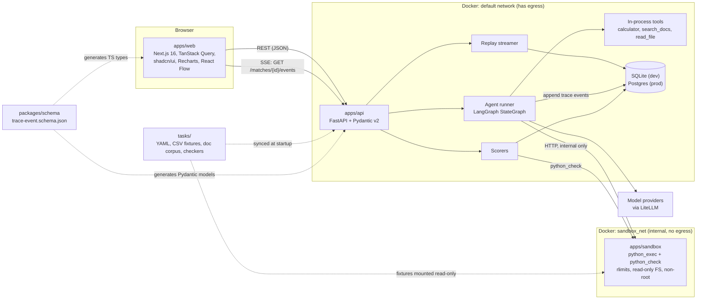
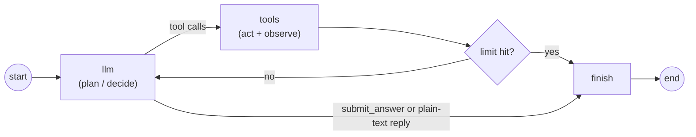
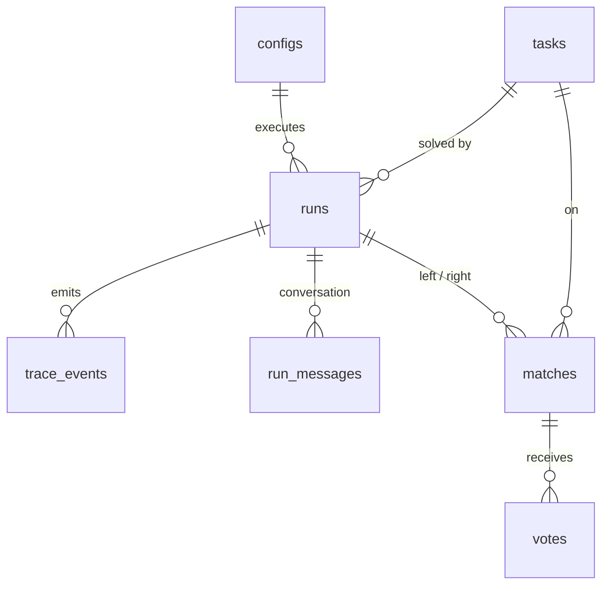
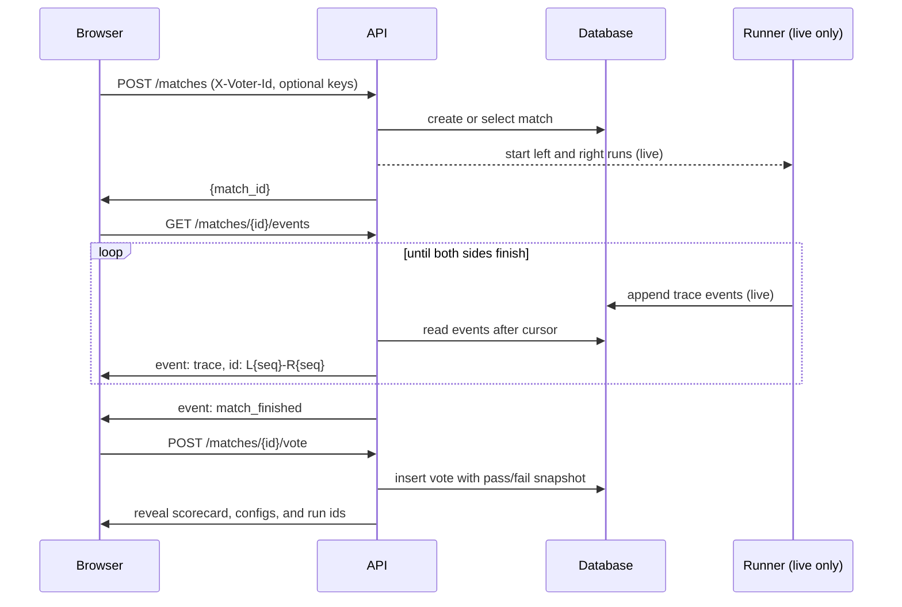

# Agent Eval Arena: Plan

Status: approved 2026-10-01. Phase 1 in progress.

This plan turns the project brief into a buildable design. Where it departs from the brief, the departure is listed in [Section 11](#11-deviations-from-the-brief) and the reason is in `DECISIONS.md`. The questions raised in Phase 0 and their answers are in [Section 12](#12-resolved-questions).

## 1. What we're building

A web app where a visitor picks a task, watches two agent configs solve it side by side as structured trace events stream in, compares them on a scorecard, and votes blind on which did better. Votes feed an Elo leaderboard shown next to an objective-metrics leaderboard, with an agreement stat that says how often human preference matches the scorer.

Priorities, in order: correct trace data, honest scoring, reproducibility, then visual polish.

## 2. Architecture

### 2.1 Components

| Component          | Responsibility                                                                                  |
| ------------------ | ----------------------------------------------------------------------------------------------- |
| `apps/web`         | Next.js 16 App Router UI. Talks to the API origin directly (CORS), no Next API routes.          |
| `apps/api`         | REST + SSE, agent runner, scorers, leaderboards, rate limiting, CLI (`arena`).                  |
| `apps/sandbox`     | Small HTTP service that executes Python for `python_exec` and `python_check`. Holds no secrets. |
| `packages/schema`  | Single JSON Schema for trace events; generates TS types and Pydantic models.                    |
| `tasks/`           | Task bank (YAML), CSV fixtures, doc corpus, checker functions. YAML is the source of truth.     |
| `data/recordings/` | Exported recorded runs (JSONL), committed, importable into any database.                        |

### 2.2 Sandbox isolation

The API container needs outbound network for model calls, so network isolation cannot be enforced on a subprocess inside it. The sandbox is a separate container:

- Attached only to `sandbox_net` (`internal: true`): no route to the internet, no published ports. The API is the only other member.
- `read_only: true` root filesystem, `tmpfs` for `/tmp`, `cap_drop: [ALL]`, `no-new-privileges`, non-root user, `mem_limit`, `pids_limit`, `cpus`.
- Each execution is a fresh subprocess in a fresh temp directory with `RLIMIT_AS`, `RLIMIT_CPU`, `RLIMIT_NPROC`, `RLIMIT_FSIZE`, and a hard wall-clock kill.
- Task fixtures are mounted read-only. The container has no API keys, no database credentials, and no environment worth reading.
- Output is truncated at a fixed byte limit before it returns to the API.

The Docker socket is never mounted anywhere.

### 2.3 Live execution and streaming are decoupled

A live run executes as an asyncio task in the API process and appends each event to `trace_events` as it happens. The SSE endpoint reads from the database (with an in-process notification as a fast path when the stream lands on the same instance). Consequences:

- A stream can reconnect, or land on a different instance, and resume exactly.
- Replay and live use the same SSE code path; they differ only in what feeds the table and how delivery is paced.
- A run survives the browser closing. A startup sweeper marks runs left in `running` by a crashed instance as `error`.

### 2.4 Agent loop

A plain LangGraph `StateGraph`. Nodes call LiteLLM directly; no LangChain chat-model adapter.

- **Answer extraction.** A control tool `submit_answer(answer: string)` is always available and is not part of `enabled_tools`. A plain-text reply with no tool call is also accepted as the final answer. Tool choice is never forced, because some current models reject forced tool use.
- **Limits.** `max_steps` (config), `max_total_tokens`, `max_cost_usd`, wall-clock timeout (environment defaults; BYOK runs get the stricter public defaults). Checked before every model call and after every step. Each model call's `max_tokens` is bounded by the remaining token budget. The whole run sits inside `asyncio.timeout`.
- **Cost.** Computed from provider-reported usage and a pricing table in the repo, keyed by model string and dated. A live run on a model missing from the table is refused, because its cost cap could not be enforced.
- **Conversation store.** The agent conversation is append-only in `run_messages`, keeping each provider message verbatim, including reasoning blocks that some providers require to be passed back unchanged.
- **Temperature.** Nullable. When null the parameter is omitted from the request.

## 3. Data model

All ids are ULIDs stored as text unless noted. All timestamps are UTC.

### `configs` (immutable; an edit inserts a new row)

| Field           | Type            | Notes                                                          |
| --------------- | --------------- | -------------------------------------------------------------- |
| `id`            | text PK         | One row per version                                            |
| `family_id`     | text            | Stable across versions of the same config                      |
| `version`       | int             | Unique with `family_id`                                        |
| `display_name`  | text            |                                                                |
| `model`         | text            | LiteLLM model string                                           |
| `provider`      | text            | Used to match BYOK keys                                        |
| `model_family`  | text            | Lineage-level, e.g. `claude`; used by the judge-exclusion rule |
| `system_prompt` | text            |                                                                |
| `enabled_tools` | JSON            | Subset of the four tools                                       |
| `max_steps`     | int             |                                                                |
| `temperature`   | float, nullable | Omitted from requests when null                                |
| `created_at`    | timestamp       |                                                                |

### `tasks` (synced from YAML; never edited through the API)

| Field                                       | Type    | Notes                                                                                               |
| ------------------------------------------- | ------- | --------------------------------------------------------------------------------------------------- |
| `id`                                        | text PK | Slug from the YAML file                                                                             |
| `title`, `category`, `prompt`, `difficulty` | text    | Category is one of `math`, `data_analysis`, `multi_hop`, `tool_trap`                                |
| `scorer_type`                               | text    | `exact`, `numeric_tolerance`, `regex`, `python_check`, `llm_judge`                                  |
| `scorer_config`                             | JSON    | Expected answer, tolerance, pattern, checker reference, or judge rubric. Never sent to the browser. |
| `required_tools`                            | JSON    | Tools the task needs; used to gate live mode                                                        |
| `content_hash`                              | text    | Hash of the YAML; stamped onto each run                                                             |
| `active`                                    | bool    |                                                                                                     |

### `runs`

| Field                                                | Type            | Notes                                           |
| ---------------------------------------------------- | --------------- | ----------------------------------------------- |
| `id`                                                 | text PK         |                                                 |
| `config_id`, `task_id`                               | FK              |                                                 |
| `task_hash`                                          | text            | Task version the run was scored against         |
| `source`                                             | text            | `recording`, `live_admin`, `live_byok`          |
| `status`                                             | text            | `pending`, `running`, `finished`, `failed`      |
| `stop_reason`                                        | text, nullable  | See Section 4                                   |
| `final_answer`                                       | text, nullable  |                                                 |
| `passed`                                             | bool, nullable  |                                                 |
| `score`                                              | float, nullable | 0 to 1                                          |
| `score_explanation`                                  | text, nullable  | For `llm_judge`, includes the judge's reasoning |
| `prompt_tokens`, `completion_tokens`, `total_tokens` | int             |                                                 |
| `cost_usd`                                           | numeric         |                                                 |
| `steps`, `tool_calls`                                | int             |                                                 |
| `latency_ms`                                         | int             | Wall clock, start to `run_finished`             |
| `started_at`, `finished_at`                          | timestamp       |                                                 |

### `trace_events`

| Field       | Type      | Notes                                             |
| ----------- | --------- | ------------------------------------------------- |
| `run_id`    | FK        |                                                   |
| `seq`       | int       | Strictly increasing per run; unique with `run_id` |
| `type`      | text      |                                                   |
| `timestamp` | timestamp |                                                   |
| `payload`   | JSON      | Validated against the schema before insert        |

`side` is not stored. It belongs to the match, because one run appears in several matches. It is added to the envelope when events are served through a match.

### `run_messages`

| Field     | Type | Notes                                              |
| --------- | ---- | -------------------------------------------------- |
| `run_id`  | FK   |                                                    |
| `idx`     | int  | Position in the conversation; unique with `run_id` |
| `role`    | text |                                                    |
| `content` | JSON | The provider message, verbatim                     |

An `llm_call` event stores `input_upto` (the model saw messages `0..input_upto`) plus a truncated preview of the messages added since the previous call. The full input is rebuilt on demand. This replaces a full copy of the conversation on every call, which would grow quadratically with step count.

### `matches`

| Field                         | Type      | Notes                                                         |
| ----------------------------- | --------- | ------------------------------------------------------------- |
| `id`                          | text PK   |                                                               |
| `task_id`                     | FK        |                                                               |
| `left_run_id`, `right_run_id` | FK        | Side assignment is randomised once, when the match is created |
| `mode`                        | text      | `replay` or `live`                                            |
| `created_at`                  | timestamp |                                                               |

A match references runs and does not own them. The 180 replay matches are built from 120 recorded runs.

### `votes`

| Field                               | Type      | Notes                                                  |
| ----------------------------------- | --------- | ------------------------------------------------------ |
| `id`                                | int PK    | Monotonic; tiebreak for Elo ordering                   |
| `match_id`                          | FK        | Unique with `voter_id`                                 |
| `voter_id`                          | text      | Anonymous id generated by the browser                  |
| `ip_hash`                           | text      | Keyed hash of the IP; the raw IP is never stored       |
| `choice`                            | text      | `left`, `right`, `tie`, `both_bad`                     |
| `left_config_id`, `right_config_id` | FK        | Denormalised so the vote log is self-contained         |
| `left_passed`, `right_passed`       | bool      | Snapshot of both scorer results, stored for every vote |
| `created_at`                        | timestamp |                                                        |

### `rate_limit_counters`

| Field          | Type      | Notes                              |
| -------------- | --------- | ---------------------------------- |
| `bucket`       | text      | `scope:ip_hash`, e.g. `vote:ab12…` |
| `window_start` | timestamp | PK with `bucket`                   |
| `count`        | int       |                                    |

Fixed-window counters, incremented with a single atomic `INSERT … ON CONFLICT DO UPDATE … RETURNING count`, which behaves the same on SQLite and Postgres. Counters live in the database so they survive restarts and are shared across instances. Expired windows are deleted opportunistically.

## 4. Trace event schema

Defined once in `packages/schema/trace-event.schema.json` (JSON Schema 2020-12, discriminated on `type`).

Envelope: `run_id`, `side` (`left`, `right`, or null on run permalinks), `seq`, `type`, `timestamp`, `redacted` (true when served in the blind view), `payload`.

| Type             | Payload                                                                                                            |
| ---------------- | ------------------------------------------------------------------------------------------------------------------ |
| `run_started`    | `config` snapshot, `task_id`                                                                                       |
| `step_started`   | `step`                                                                                                             |
| `llm_call`       | `model`, `input_upto`, `input_preview[]`, `output`, `prompt_tokens`, `completion_tokens`, `cost_usd`, `latency_ms` |
| `tool_call`      | `call_id`, `tool`, `arguments`                                                                                     |
| `tool_result`    | `call_id`, `output` (truncated), `truncated`, `success`, `latency_ms`, `error`                                     |
| `step_finished`  | `step`, cumulative `total_tokens`, `cost_usd`                                                                      |
| `run_finished`   | `final_answer`, `cost_usd`, `total_tokens`, `steps`, `latency_ms`, `stop_reason`                                   |
| `score_computed` | `passed`, `score`, `scorer_type`, `explanation`                                                                    |
| `error`          | `message`, `recoverable`                                                                                           |

`stop_reason` is one of `answered`, `max_steps`, `max_tokens`, `max_cost`, `timeout`, `error`. The brief lists four values but requires three budget limits, so the token and cost limits have their own values.

**Generation.** `json-schema-to-typescript` writes `packages/schema/generated/trace-event.ts`. `datamodel-code-generator` writes `apps/api/src/arena/schema_gen.py`. Both outputs are committed. `pnpm schema:check` regenerates and fails on any diff, and runs in lint.

### 4.1 Blind view

Before the vote, a voter sees only what each agent did and what it answered: the traces and the final answers, with a counter strip showing step count and elapsed time. Pass/fail, score, cost, tokens, and config names are revealed together after the vote. If the result were visible first, voters would pick the side that passed and the agreement stat would be circular.

Redaction happens on the server. Until the requesting voter has voted on a match, everything served for that match (the SSE stream and `GET /matches/{id}`) is filtered as follows, and each filtered event carries `redacted: true`:

| Event            | Before the vote                                                                                                                      |
| ---------------- | ------------------------------------------------------------------------------------------------------------------------------------ |
| every event      | `run_id` replaced by a match-scoped alias                                                                                            |
| `run_started`    | `config` is null                                                                                                                     |
| `llm_call`       | `model`, `prompt_tokens`, `completion_tokens`, `cost_usd` are null; system messages removed from `input_preview`                     |
| `step_finished`  | `total_tokens`, `cost_usd` are null                                                                                                  |
| `run_finished`   | `cost_usd`, `total_tokens` are null; `stop_reason` is null when it is `max_tokens` or `max_cost` (the UI shows "stopped at a limit") |
| `score_computed` | not sent at all                                                                                                                      |

Still visible: step numbers, tool calls and results, model output, the final answer, per-call and total `latency_ms`, and `error` events.

The schema marks every redactable field as nullable, so the blind view is valid against the same schema. After the vote, the API returns the full events, the scorecard, both configs, and the run ids.

## 5. API

Base path `/api`. Requests carry `X-Voter-Id` (an anonymous UUID the browser generates and keeps in local storage). Admin calls carry `Authorization: Bearer <ADMIN_TOKEN>`. No cookies, so the web and API can sit on different origins.

| Method and path                          | Request                                                                                                            | Response                                                                                                                                                               |
| ---------------------------------------- | ------------------------------------------------------------------------------------------------------------------ | ---------------------------------------------------------------------------------------------------------------------------------------------------------------------- |
| `GET /health`                            |                                                                                                                    | `{status, version, db}`                                                                                                                                                |
| `GET /meta`                              |                                                                                                                    | `{default_mode, live_available, limits, categories, sandbox_available}`                                                                                                |
| `GET /tasks?category=`                   |                                                                                                                    | `[{id, title, category, difficulty, required_tools}]`                                                                                                                  |
| `GET /tasks/{id}`                        |                                                                                                                    | Task with prompt. Never includes `scorer_config`.                                                                                                                      |
| `GET /configs`                           |                                                                                                                    | Latest version of each family, with version history                                                                                                                    |
| `GET /configs/{id}`                      |                                                                                                                    | One config version                                                                                                                                                     |
| `POST /configs` (admin)                  | `{family_id?, display_name, model, provider, model_family, system_prompt, enabled_tools, max_steps, temperature?}` | `201` new version                                                                                                                                                      |
| `POST /matches`                          | `{task_id \| "random", left_config_id \| "random", right_config_id \| "random", mode}`                             | `{match_id, mode, task}`. Replay returns an existing match the voter has not voted on. Live returns `202` and starts both runs.                                        |
| `GET /matches/{id}`                      |                                                                                                                    | Task, `voted`, and per side: status, step count, elapsed time, final answer. After the vote it adds pass/fail, score, cost, tokens, both configs, run ids, and tallies |
| `GET /matches/{id}/events?voter=&speed=` | `Last-Event-ID` header                                                                                             | SSE stream, Section 6                                                                                                                                                  |
| `POST /matches/{id}/vote`                | `{choice}`                                                                                                         | `201 {reveal: {left, right}, scorecard, tallies}`; `409` if already voted or match unfinished; `429` if rate limited                                                   |
| `GET /runs/{id}`                         |                                                                                                                    | Run, config, metrics, score                                                                                                                                            |
| `GET /runs/{id}/events?after=&limit=`    |                                                                                                                    | Paginated events                                                                                                                                                       |
| `GET /runs/{id}/events/{seq}/input`      |                                                                                                                    | Full reconstructed model input for one `llm_call`                                                                                                                      |
| `GET /leaderboard/preference?category=`  |                                                                                                                    | `[{config, elo, ci_low, ci_high, votes, wins, losses, ties}]`                                                                                                          |
| `GET /leaderboard/objective?category=`   |                                                                                                                    | `[{config, runs, pass_rate, pass_ci, mean_cost_usd, mean_steps, mean_latency_ms, passes_per_dollar}]`                                                                  |
| `GET /leaderboard/agreement?category=`   |                                                                                                                    | `{decisive_votes, agreement_rate, ci, table, left_pick_rate}`                                                                                                          |

**Live mode auth.** `POST /matches` with `mode: "live"` needs either the admin token or `X-Provider-Keys` (a JSON map of provider to key). Visitor keys are passed to the run tasks in memory, never written to the database or logs, and dropped when the runs end. BYOK is limited to configs whose providers the visitor supplied, and to tasks whose `required_tools` are available.

Run ids are only returned after the voter has voted, so the unblinded `/runs/{id}` permalink is not reachable from a blind match.

## 6. SSE event flow

`EventSource` is GET-only and cannot send custom headers, so creating a match (which may carry keys) is a POST, and the stream is a separate GET.

Events on the stream are served in the blind view (Section 4.1) until the voter has voted.

- **Event id** is a cursor holding the last delivered `seq` for each side (`L12-R9`). On reconnect the browser sends it as `Last-Event-ID` and the server resumes from there.
- **Ordering.** Within a side, `seq` is strictly increasing with no gaps. Across sides, events are interleaved by timestamp.
- **Replay pacing.** Events are delivered using the gaps between their original timestamps. `speed` accepts 1, 2, or 4. The UI offers "skip to end".
- **Keep-alive.** A comment line every 15 seconds, and `X-Accel-Buffering: no`, so proxies do not buffer or drop the stream.
- **Granularity.** Streaming is per trace event; there are no token-level deltas. During a model call the pane shows the open step from `step_started`. This keeps the wire format identical to the stored trace, so a replay is exact.

## 7. Scoring, tasks, and leaderboards

### 7.1 Task bank

30 tasks: 8 math word problems, 8 data analysis (bundled CSVs, needs `python_exec`), 8 multi-hop questions (doc corpus, needs `search_docs`), 6 tool-selection traps.

Each task is one YAML file under `tasks/<category>/`. Every task ships with a known-correct and a known-wrong answer, and a test asserts the scorer passes one and fails the other.

### 7.2 Scorers

| Scorer              | Behaviour                                                                                      |
| ------------------- | ---------------------------------------------------------------------------------------------- |
| `exact`             | Compare after normalisation (trim, case-fold, collapse whitespace, strip trailing punctuation) |
| `numeric_tolerance` | Extract the number, compare with absolute or relative tolerance                                |
| `regex`             | Match the normalised answer against a pattern                                                  |
| `python_check`      | Run a checker function from `tasks/checkers/` in the sandbox                                   |
| `llm_judge`         | Rubric plus structured verdict; reasoning logged in `score_computed.explanation`               |

**Judge rule.** The judge's `model_family` must differ from every contestant config's, to avoid self-preference bias. The API checks this at startup and before any recording, and refuses to score an `llm_judge` task when the rule is broken.

**The recorded bank has no `llm_judge` tasks.** All 30 tasks use deterministic scorers. `llm_judge` is implemented and tested (with the scripted fake client) so it is available for future tasks, but with contestants on two providers there is no eligible judge without a third.

### 7.3 Proposed configs

Final model strings are confirmed against LiteLLM in Phase 2, once the keys in `.env` show which providers are available.

| Config               | Model                                                                                                      | Prompt            | Tools                     |
| -------------------- | ---------------------------------------------------------------------------------------------------------- | ----------------- | ------------------------- |
| `strong`             | Provider A flagship (if A is Anthropic: `claude-opus-5-5`)                                                 | Full agent prompt | All four                  |
| `cheap`              | Provider B small model if a second key is present, otherwise provider A's small model (`claude-haiku-4-5`) | Full agent prompt | All four                  |
| `strong-bare-prompt` | Same as `strong`                                                                                           | One-line prompt   | All four                  |
| `cheap-two-tools`    | Same as `cheap`                                                                                            | Full agent prompt | `calculator`, `read_file` |

The second pair isolates one variable each (prompt, tools) against its base config, so differences on the leaderboard can be attributed.

### 7.4 Human preference leaderboard

- Elo, K=32, start 1000, replayed over the vote log in `(created_at, id)` order. `tie` and `both_bad` both score 0.5 each; `both_bad` is kept distinct in the log.
- Always recomputed from the log (cached, keyed by the latest vote id), never stored.
- 95% interval by percentile bootstrap: 1000 resamples of the votes with replacement, each in shuffled order, seeded so the output is reproducible.
- The headline rating is the chronological one, which is deterministic and can be checked by hand. The `/about` page states that online Elo depends on vote order.

### 7.5 Objective leaderboard

Computed over the recorded set, where every config has exactly one run per task, so denominators match. Columns: pass rate with a Wilson interval, mean cost per task, mean steps, mean latency, and passes per dollar (total passes divided by total cost).

### 7.6 Agreement

- **Headline:** over votes on matches where exactly one side passed, the share that picked the passing side. `tie` and `both_bad` count as disagreement there.
- **Full table:** every vote is stored with both sides' pass/fail, so the page and the README can also show how people vote when both passed or both failed.
- **Position bias:** the share of non-tie votes that picked the left pane, as a check on the blind setup.

The stat is only meaningful because voters cannot see pass/fail, score, cost, or tokens before they vote (Section 4.1).

### 7.7 Methodology notes for `/about`

The page must state, in plain terms:

- **What voters see.** Before voting: both traces and final answers, step count, elapsed time. After voting: pass/fail, score, cost, tokens, and which config was on which side. The server withholds the rest, so it is not in the page source either.
- **What is still not blind.** Elapsed time and the style of a trace can hint at which model is behind a pane. A visitor who votes from a second browser can unblind a match. Position bias is reported.
- **Scoring.** Every recorded task uses a deterministic scorer. An LLM judge exists in the codebase but is not used for any recorded task; if it is ever used, the judge must come from a different model family than every contestant, to avoid self-preference bias.
- **Elo.** K=32, start 1000, replayed over the vote log in order; online Elo depends on that order; intervals come from a seeded bootstrap.
- **Agreement.** Defined on matches where exactly one side passed.
- **Limits of the data.** One recorded run per config per task; model output is not deterministic, so replays are recordings and a re-run can differ; votes on a public demo can be manipulated.

## 8. Modes, cost, and abuse control

|                  | Replay (default)              | Live                               |
| ---------------- | ----------------------------- | ---------------------------------- |
| Who              | Any visitor                   | Admin token, or visitor's own keys |
| Model calls      | None                          | Real                               |
| Source of events | Recorded runs in the database | Runner                             |
| Votes            | Counted                       | Counted                            |

- **Per-run limits:** `max_steps`, `max_total_tokens`, `max_cost_usd`, timeout. Each ends the run cleanly with its own `stop_reason`, then the run is scored as normal.
- **Rate limits per IP hash:** votes and live matches, database-backed (Section 3). Defaults are environment variables.
- **Recording script** (`arena record`): idempotent per `(config, task)`, resumable, with a global budget guard that stops before the cumulative spend would exceed the cap.
- **Recording budget: $20 total, including the pilot.** The script first runs a 10-run pilot spread across configs and categories, reports measured cost per run per config and the projected total for all 120, and stops. The remaining runs start only after you approve.
- **Export.** Recorded runs are exported to `data/recordings/*.jsonl` and committed, so the deployed database can be seeded and the README numbers can be reproduced without spending again.
- **Scrubbing.** The exporter removes API keys, auth headers, and every value from `.env` before writing, and refuses to write a record that still matches a key-like pattern. A test scans `data/recordings/` and fails if any key-like pattern appears, so a leak cannot be committed unnoticed.

## 9. Phases and acceptance criteria

Every phase ends with: files changed, tests run, a commit, a report (what was done, exact verification commands, decisions, open questions), then a stop.

Backend commands run in Docker. Root scripts wrap them (`pnpm test:api` runs pytest for the API and the sandbox in their containers).

| Phase                  | Deliverable                                                                                                                                                                                                                            | Acceptance                                                                                                                                                                                                                                             |
| ---------------------- | -------------------------------------------------------------------------------------------------------------------------------------------------------------------------------------------------------------------------------------- | ------------------------------------------------------------------------------------------------------------------------------------------------------------------------------------------------------------------------------------------------------ |
| 0 Planning             | This plan, `CLAUDE.md`, `DECISIONS.md`                                                                                                                                                                                                 | You approve this document                                                                                                                                                                                                                              |
| 1 Scaffold             | Monorepo, `web` + `api` + `sandbox` booting, compose file, lint/format/typecheck, health endpoint, schema generation, `.env.example`. Starts with a Next 16 install-and-build smoke test of shadcn/ui, React Flow, and TanStack Query. | `docker compose up` brings up the API and sandbox, `pnpm dev:local` adds the web app on the host, `pnpm web:prodcheck` builds and serves it in a container; `pnpm lint`, `pnpm typecheck`, `pnpm test:api` pass; `pnpm schema:check` passes            |
| 2 Runner + tracing     | LangGraph loop, four tools, sandbox service, event emitter, pricing table, `arena run` CLI                                                                                                                                             | Unit tests per tool, including sandbox escape attempts (network, filesystem writes, fork bomb, memory bomb, infinite loop) and timeouts; every emitted event validates against the schema; a test per limit proving the right `stop_reason`            |
| 3 Tasks + scorers      | 30 YAML tasks, fixtures, corpus, all scorers, `arena eval` CLI                                                                                                                                                                         | Per task, a test that a known-correct answer passes and a known-wrong one fails                                                                                                                                                                        |
| 4 DB + API + streaming | Models, Alembic migrations, REST endpoints including a basic vote endpoint, SSE endpoint, blind-view redaction                                                                                                                         | Integration test: start a match, consume the stream, both sides finish with gap-free `seq` and a stored score; reconnect test resumes from the cursor; a test that no redacted field and no `score_computed` event reaches a client that has not voted |
| 5 Arena UI             | `/arena` pickers, split-pane traces, counter strip (steps and elapsed time only before the vote), list view, plain vote buttons, scorecard shown after the vote                                                                        | A full match runs in the browser against the local backend; component tests for the trace card and scorecard                                                                                                                                           |
| 6 Voting + reveal      | Reveal animation, vote validation, double-vote handling, DB-backed rate limits                                                                                                                                                         | Tests for vote validation, double-vote rejection, and rate limit persistence across a restart                                                                                                                                                          |
| 7 Leaderboards         | Elo, bootstrap intervals, objective table, agreement, category filters                                                                                                                                                                 | Elo matches hand-computed examples; bootstrap is deterministic under a fixed seed; page renders with seeded data                                                                                                                                       |
| 8 Replay + cost safety | Replay streamer, recording script with pilot gate, scrubbed export, mode switching, BYOK, budget caps                                                                                                                                  | A visitor completes a match and votes while the model client is mocked and asserted never called; budget guard test; a test that fails if a key-like pattern appears in `data/recordings/`                                                             |
| 9 Polish               | Theme, graph view, permalinks, `/about`, empty/loading/error states, mobile layout, Open Graph images                                                                                                                                  | Lighthouse ≥ 90 for performance and accessibility; Playwright end-to-end test passes                                                                                                                                                                   |
| 10 Results + launch    | Pilot, then full recording after approval; README with measured results; deployment                                                                                                                                                    | Deployed app works end to end in replay mode                                                                                                                                                                                                           |

## 10. Risks

| Risk                                                                                                                                      | Handling                                                                                                                                                                                                                                 |
| ----------------------------------------------------------------------------------------------------------------------------------------- | ---------------------------------------------------------------------------------------------------------------------------------------------------------------------------------------------------------------------------------------- |
| Blind voting leaks the result or the identity of a side                                                                                   | Pass/fail, score, cost, tokens, model, prompt, and config are withheld on the server until the vote (Section 4.1), with a test. Elapsed time and trace style can still hint at the model; `/about` says so and position bias is reported |
| A secret ends up in committed recordings                                                                                                  | Exporter scrubs and refuses key-like content; a test scans the recordings folder                                                                                                                                                         |
| Provider quirks through LiteLLM: models that reject `temperature` or forced tool choice, reasoning blocks that must be returned unchanged | Nullable temperature, no forced tool choice, verbatim message store; a contract test per configured provider in Phase 2                                                                                                                  |
| Sandbox escape                                                                                                                            | Layered isolation (Section 2.2), no secrets in the sandbox, escape attempts in the test suite                                                                                                                                            |
| SQLite on a Windows bind mount (locking and WAL problems)                                                                                 | The database file lives in a Docker named volume; WAL mode and a busy timeout                                                                                                                                                            |
| Slow file watching through Windows bind mounts                                                                                            | Polling watchers in the containers; `pnpm --filter web dev` on the host as a faster alternative                                                                                                                                          |
| SSE buffered or cut by proxies                                                                                                            | Heartbeats, `X-Accel-Buffering: no`, browser connects to the API origin directly, cursor-based resume                                                                                                                                    |
| Recording overspend                                                                                                                       | Per-run cap, global budget guard, 10-run pilot with a stop for approval                                                                                                                                                                  |
| One run per config per task is a small sample                                                                                             | Wilson intervals on pass rates, stated on `/about` and in the README; repeat runs only if budget remains and you approve                                                                                                                 |
| Tasks that do not separate the configs                                                                                                    | The pilot reports pass rates per task; tasks every config passes or fails are revised before the full recording                                                                                                                          |
| Elo instability with few votes                                                                                                            | Bootstrap intervals shown next to every rating; configs under a minimum vote count are marked provisional                                                                                                                                |
| Vote manipulation on a public demo                                                                                                        | Per-IP limits and one vote per match per voter id; acknowledged on `/about` as not robust against a determined actor                                                                                                                     |
| Next.js 16 incompatibility with a UI library                                                                                              | Registry peer ranges already check out; the Phase 1 smoke test confirms before anything is built on it. If it fails, I stop and tell you before falling back to 15                                                                       |
| Docker Desktop problems on Windows                                                                                                        | I report the problem and ask before switching anything to WSL                                                                                                                                                                            |
| Lighthouse score with React Flow and Recharts                                                                                             | Both are loaded lazily, only on the views that use them                                                                                                                                                                                  |

## 11. Deviations from the brief

All approved by the owner.

1. Next.js 16 instead of 15.
2. The Python backend runs in Docker; `uv` is not installed on the host.
3. `python_exec` runs in a separate sandbox container.
4. Production is replay-first; live `python_exec` needs the sandbox service deployed.
5. A match references two runs; 120 recorded runs make 180 replay matches.
6. `temperature` is nullable.
7. LangGraph nodes call LiteLLM directly.
8. Blind-view redaction and randomised side assignment.
9. Match creation by POST, stream by GET, with cursor resume.
10. Conversation stored once per run instead of a full copy per `llm_call`.
11. Reproducibility is claimed for tools, fixtures, and scorers, not for model output.

12. `apps/sandbox` is added to the monorepo layout.
13. `stop_reason` gains `max_tokens` and `max_cost`.
14. `side` is added at serving time and is not stored on the event.
15. The voter id is a browser-generated header value, not a cookie.
16. Tailwind v4 keeps design tokens as CSS variables in one stylesheet (`@theme`), not in a `tailwind.config` file. The theme is still swappable in one place.
17. Recorded runs are committed to the repo as JSONL, scrubbed of secrets, with a test that scans for key-like patterns.
18. The scorecard is shown after the vote, not before. Before the vote the UI shows traces, final answers, step count, and elapsed time only, and the server withholds everything else.
19. The recorded task bank has no `llm_judge` tasks.

## 12. Resolved questions

| Question                                    | Answer                                                                                                                                                    |
| ------------------------------------------- | --------------------------------------------------------------------------------------------------------------------------------------------------------- |
| Judge model versus two-provider contestants | Deterministic scorers for all 30 recorded tasks. `llm_judge` is built and tested but kept out of the recorded bank.                                       |
| `apps/sandbox` in the layout                | Approved.                                                                                                                                                 |
| More dependencies                           | Approved: `pydantic-settings`, `uvicorn`, `pytest-asyncio`, `jsonschema`, `python-ulid`, `numpy` and `pandas` (sandbox image only), `openapi-typescript`. |
| `stop_reason` values                        | `max_tokens` and `max_cost` added.                                                                                                                        |
| Committing recordings                       | Approved, on condition that they are scrubbed and a test fails on any key-like pattern.                                                                   |
