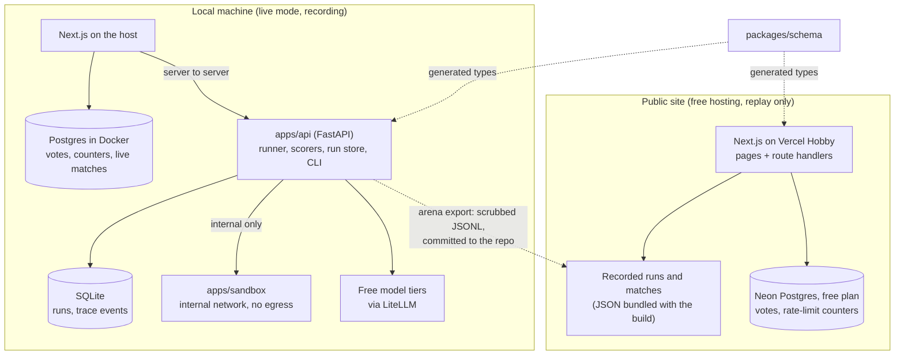
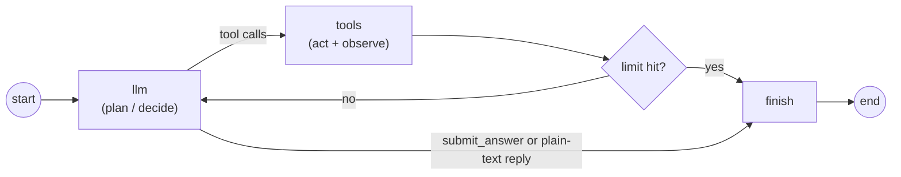
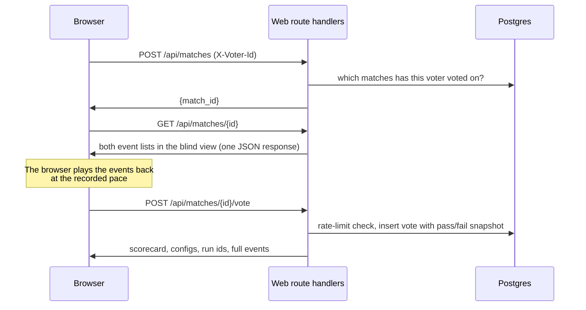

# Agent Eval Arena: Plan

Status: revised 2026-10-03. Checkpoints B and B2 are complete: 270 runs are recorded (three of every model on every task) and the Poison Pen game (Section 0.1) works locally in all five modes. Checkpoint C (launch, Section 0.2) is built and tested locally and waits on the owner's deployment to Vercel and Neon. **Sections 0, 0.1, and 0.2 are the current design.** Later sections were written for an earlier shape of the project (four free-tier configs, a Python run store, live mode); where they disagree with Section 0, Section 0 wins, and the sections that no longer apply are marked.

Where this plan departs from the brief, the departure is listed in [Section 12](#12-deviations-from-the-brief) and the reason is in `DECISIONS.md`.

## 0. Current design

**What it is.** Three Claude models are given the same 30 tasks with the same prompt, tools, and limits. A visitor sees two of them side by side on one task without knowing which is which, votes, and then sees the models, this site's measured results, and Anthropic's published benchmark scores. The leaderboard puts three rankings next to each other: visitor votes, official benchmarks, and this site's scorer.

**Configs.** Three, differing only in the model: `claude-haiku-full` (Haiku 4.5), `claude-sonnet-full` (Sonnet 5.5), `claude-opus-full` (Opus 5.5). All Gemini, Groq, and Qwen configs are removed from the product and the recording plan. The LiteLLM backend code and its tests stay in the repository, unused.

**Numbers.** 30 tasks × 3 configs = 90 runs. 3 pairings × 30 tasks = 90 matches. One Elo board.

**How runs are made.** `arena record` runs each missing (config, task) pair once on the owner's Claude subscription through the Claude Agent SDK, Haiku first, and writes one scrubbed JSONL file per run into `data/recordings/runs/`. A pair is done when its file exists, so the command resumes. It stops cleanly at a usage limit and prints when the limit resets. It then rebuilds `runs-index.json`, `matches.json`, and `tasks.json`. There is no SQLite run store: the committed files are the store.

**The site.** Next.js only. Route handlers read the recordings from `data/` and keep votes and rate-limit counters in Postgres (Docker locally, Neon in public). The Python backend is used only to record. **Live mode is not built**: every match is a replay.

**Blind view.** Before the vote the server withholds: config and model names, the system prompt, run ids, tokens, cost, pass/fail and the constraint checks, **the models' thinking blocks, and every measure of time** (per-call latency, tool latency, run time, and the timestamps, which are replaced by a constant). Haiku does not think and the models differ in speed, so either would identify the model. **Since 2026-10-03 the trace is not sent at all before the decision**, only the final answer: Haiku averages 1.89 steps to the others' 1.22, so the step count and the number of tool calls identified it (Section 0.2). The redaction still runs, and the answer is read from its output.

**Reveal.** After the vote: both model names, a scorecard of this site's measured results for both sides (scorer result, steps, tool calls, tokens, active time, answer length, cost actual and at API rates), the vote tallies for the match, the full traces with thinking and timing, and an "Official benchmarks" panel.

**Official benchmarks.** `data/official-benchmarks.json` holds Anthropic's published scores for the three models, copied from its announcement pages, each with its source URL and the date checked. The panel links the sources and says the scores measure different tasks from ours. Anthropic publishes no benchmark that Haiku 4.5 shares with Opus 5.5 or Sonnet 5.5, so the data can order Opus and Sonnet (on eight shared benchmarks) but gives Haiku no official rank; the site shows that as "no shared benchmark" and does not invent a place for it.

**Leaderboard.** The headline is one table: each model's rank by visitor Elo, by official benchmarks, and by this site's scorer, filterable by category. Below it: the Elo table with bootstrap intervals, the scorer table (pass rate on code and agent tasks, constraints met on open-ended tasks), the official scores, and, as secondary checks on the votes, agreement with the scorer (code and agent tasks only), length bias (open-ended tasks), and position bias.

**Rendering model output.** Final answers render as markdown with `react-markdown` and `remark-gfm`, with no raw-HTML plugin, so HTML in an answer is shown as text. Diagram answers are drawn with Mermaid at `securityLevel: "strict"`; if drawing fails the source is shown as text. A test feeds a `<script>` tag, an `onerror` attribute, and a `javascript:` link through both.

**Not built yet.** Live mode and the Python run API (dropped unless the owner wants them back), the React Flow graph view, run permalinks, Open Graph images, the README results section, and deployment. The theme and the Playwright test arrived with Checkpoint B2 (Section 0.1).

## 0.1 Checkpoint B2: "Poison Pen: A Wrenfield Hall Mystery"

Requested by the owner on 2026-10-02. The replay site becomes a game with a 1930s country-house theme. This section is the design; where it disagrees with Section 0 on the site's pages, routes, or vote storage, this section wins. The recordings, the scorers, the three configs, and the official-benchmarks data are unchanged.

**The fiction.** Every evening an unsigned letter appears at dinner at Wrenfield Hall. Each recorded answer is a letter. Six guests sit at the table, but only three authors exist underneath: Haiku 4.5, Sonnet 5.5, and Opus 5.5. The player decides which letters to trust and unmasks the author. No real author's name, detective, or book title appears anywhere; `/about` says "inspired by golden-age detective fiction".

### What existed before this checkpoint

| From the spec                                                              | State before B2                                                                           |
| -------------------------------------------------------------------------- | ----------------------------------------------------------------------------------------- |
| Two-letter blind vote (The Drawing Room)                                   | Built, as the `/arena` match page with four choices. No guests, confidence, or accusation |
| Server-side redaction of model, cost, tokens, timing, thinking; leak tests | Built, for two-letter matches only                                                        |
| Vote fields: both sides' pass state, answer lengths, task, category        | Built. No mode, guest, confidence, or trap flag                                           |
| Elo, position bias, length bias, agreement, official-benchmarks panel      | Built                                                                                     |
| Second run of each model on each task (for traps)                          | Not recorded                                                                              |
| Library, Weekend, Timetable, Morning Post, impostor traps, accusations     | Not built                                                                                 |
| Guests, portraits, theme, XP, ranks, distinctions, Casebook, challenges    | Not built                                                                                 |
| Playwright test                                                            | Not built                                                                                 |

### Fairness rules (these outrank everything else in this section)

- **Seats are costumes, not models.** The guest shown beside a letter comes from a hash of the round (and, in free-play modes, the voter), never from the run or its model. The function that assigns guests does not receive the model.
- **Hidden before the decision:** model and config names, the system prompt, run ids, cost, tokens, all timing, thinking blocks, word counts, the scorer's result, how the letter was written (the trace, its steps and tool calls; added 2026-10-03), and the guest's expression (the server sends none; the page shows neutral). One redaction function serves every mode, and the leak tests run over every mode's rounds built from the real recordings.
- **Stored with every decision:** mode, round kind, the guest and position of every letter, the run behind each, confidence, the trap flag, answer lengths, and pass state.
- **Points only for answers that can be right or wrong:** naming the author, calling the timetable, accusing (or not) correctly. A preference earns no points, and nothing is awarded for agreeing with other players. The share of players who trusted the same letter is shown after the decision, as information.
- **Elo uses only preferences from The Drawing Room and The Library Gathering, never a trap round**, and never a preference from the Weekend or the Morning Post.
- **Costume bias and position bias** are reported on the leaderboard once there are at least 30 two-letter preference votes: for each guest, how often the letter in that seat was trusted, against the 50% expected if costumes do not matter.

### Three runs of everything

Every model ran every task three times with the same settings (`arena record --take 2`, `--take 3`): 270 runs. They are stored as `runs/<config>__<task>[__2|__3].jsonl` with `take` in the header.

- **Totals** on the site are over all three runs, shown with the lowest and highest run: "passed 9 of 10 across 3 runs", "met 85–97 of 101 rules". The scorer's rank uses the mean score over all runs.
- **Run-to-run variance** is on The Official Record: for each model, the tasks whose score changed between identical runs, the mean and largest gap between its best and worst run of a task, and its whole-bank score in its lowest and highest run. It is the noise floor under every comparison on the site.
- **A trap round** shows any two of a model's three runs on one task.
- Ordinary duels, rankings, and author rounds use first runs, so one player sees one letter per author per task.

### Rounds

A round has a kind, and each mode is a way of dealing rounds.

| Kind        | Shows                                                                 | Asks                                                                                                                 | Right answer?                                                                                                                                                 |
| ----------- | --------------------------------------------------------------------- | -------------------------------------------------------------------------------------------------------------------- | ------------------------------------------------------------------------------------------------------------------------------------------------------------- |
| `duel`      | Two letters on one task                                               | "Trust letter A", "Equally good", "Neither", "Trust letter B", or "Accuse: one author, two seats"                    | Only the accusation: right when the round is a trap (+50), wrong otherwise (−30). Trusting a letter in a trap round scores nothing and counts as being fooled |
| `ranking`   | All three authors' letters on one task                                | Rank 1-2-3. There is no accusation: all three authors are always present                                             | None                                                                                                                                                          |
| `author`    | One letter                                                            | Which of the three authors wrote it                                                                                  | Yes (+100)                                                                                                                                                    |
| `timetable` | One letter in full. The scorer's verdict and the working are withheld | "It holds" or "It falls apart": did it pass the hidden tests (code, agent) or meet all the stated rules (open-ended) | Yes (+40)                                                                                                                                                     |

Confidence ("A hunch", "Fairly sure", "Certain") is chosen before every submission and stored. It does not change points; the Casebook reports how often the player was right at each level.

| Mode                     | Rounds                                                                                                                                                                                                                                                                        | Counts toward Elo |
| ------------------------ | ----------------------------------------------------------------------------------------------------------------------------------------------------------------------------------------------------------------------------------------------------------------------------- | ----------------- |
| The Drawing Room         | One `duel` at a time, on a pairing the player has not judged. About 1 in 8 is a trap                                                                                                                                                                                          | Yes, except traps |
| The Library Gathering    | One `ranking` at a time, on a task the player has not ranked. Each ranking becomes three pairwise results, tagged by mode                                                                                                                                                     | Yes               |
| Does the Timetable Hold? | One `timetable` at a time                                                                                                                                                                                                                                                     | No                |
| A Weekend at Wrenfield   | Ten seeded rounds: author, author, duel, timetable, author, duel, timetable, author, duel, timetable. Three candles; a wrong author, a wrong timetable call, a false accusation, or trusting a letter in a trap round blows one out, and the game ends when all three are out | No                |
| The Morning Post         | Five rounds, the same for everyone on a given UTC date: author, timetable, duel, author, timetable. The result is shared as squares, for example `Poison Pen · Morning Post No. 14 ■■□■■`                                                                                     | No                |

- **Difficulty in the Weekend.** Rounds 1 to 4 use clear differences; rounds 5 to 10 use close matches and traps. A pair is _close_ when the two runs have the same score and their lengths are within 25% of the longer; otherwise _clear_. For an author round, the letter is _clear_ when its run differs in that way from both other models' runs on the task. The first duel is never a trap; each of the other two is a trap with probability 5/8, which makes about 1 round in 8 a trap.
- **Timetable rounds are dealt by outcome.** Every one of the 270 runs can be shown. 223 of them hold and 47 fall apart, so dealing at random would make "It holds" right 83% of the time. Instead a round is first chosen to be one that held or one that fell, with equal chance, and then a run of that kind is drawn. Always answering "It holds" is then right about half the time. A cost: 30 of the 47 that fall are explanation tasks, so the kind of task is itself a clue; and a player who works through every round runs out of the ones that fall.
- **In a duel inside the Morning Post**, the square is filled when the player accused a trap or did not accuse a non-trap.

### Seeds and round ids

Every round has an id the server can rebuild the round from, and which does not name its runs: `dr.<hash>`, `lib.<hash>`, `tt.<hash>` for free play (a hash of the content), `wk.<seed>.<n>` for a Weekend, `mp.<day>.<n>` for the Morning Post. Seeded rounds are generated by one seeded generator, so the same seed gives the same ten rounds, guests, and seat order to everyone; that is what a challenge link relies on. In free play, guests and seat order also depend on the voter, so they vary between players. One decision per voter per round id.

### Reveal: "The Gathering in the Library"

After a decision the server returns: each guest's expression (trusted → happy, the other → shocked, a caught impostor → flustered), which model wrote each letter, that round's figures (rules met or pass/fail, words, cost at API rates), the model's 30-task totals, "X% of sleuths trusted the same letter" when at least five players have judged that pairing (otherwise "You're among the first to dine here."), the official-benchmarks panel, the points gained, and any distinction unlocked. A trap is announced as "One author, two seats!".

### Progression (computed from the decision log; nothing is stored about a player but their decisions)

- **Ranks by points:** Guest (0), Amateur Sleuth (200), Private Inquiry Agent (600), Celebrated Detective (1,500).
- **Distinctions:** Spotted the Impostor (one correct accusation); An Ear for Haiku (named Haiku correctly three times); Expensive Taste (trusted Opus in every one of at least five non-trap preference rounds that included it); Thoroughly Fooled (trusted a letter in two trap rounds); Master of the Library (ranked ten Library Gatherings); Survived the Weekend (finished ten Weekend rounds with a candle still lit).
- **My Casebook**, after ten decisions: a method name from the player's own votes (for example "The Plain Speaker" for mostly trusting the shorter letter), the author and the guest most trusted, author-naming accuracy, impostors caught, agreement with other players and with the official benchmark order, accuracy by confidence, and the latest Morning Post grid. A share link (a random id, not the browser id) and a copy-text button.
- **Challenge a friend:** a link to the same seeded Weekend. When the friend finishes, both scores are shown with a "taste compatibility" figure: the share of rounds both played on which they gave the same answer.
- Anonymous browser id only. No accounts.

### Pages and routes

Pages: the Lobby (`/`), The Guest List (`/guests`), `/drawing-room`, `/library`, `/weekend`, `/timetable`, `/morning-post`, `/challenge/[id]`, The Official Record (`/record`), `/casebook` and `/casebook/[share]`, `/about`. The old `/arena/[id]` and `/leaderboard` pages are removed.

| Method and path                                         | Purpose                                                                             |
| ------------------------------------------------------- | ----------------------------------------------------------------------------------- |
| `POST /api/rounds/next`                                 | The next round for a mode (and game), blind, with the game's state                  |
| `GET /api/rounds/{id}`                                  | A round: blind, or the reveal if this player has decided it                         |
| `POST /api/rounds/{id}/decide`                          | Record an answer with its confidence; returns the reveal                            |
| `GET /api/profile`                                      | Points, rank, distinctions, Casebook                                                |
| `POST /api/casebook/share`, `GET /api/casebook/{share}` | Make and read a share link                                                          |
| `POST /api/challenges`, `GET /api/challenges/{id}`      | Make a challenge from a finished Weekend; read both results                         |
| `GET /api/leaderboard?category=`                        | The Official Record                                                                 |
| `GET /api/art`                                          | Which portrait files exist, so dropped-in PNGs replace the SVGs with no code change |

Postgres: `decisions` replaces `votes` (one row per voter per round, with the fields listed under the fairness rules), plus `shares` and `challenges`. Match building moves from the Python index builder to TypeScript round generation; `matches.json` is no longer written.

### What B2 built, and what it did not

Built: everything in this section. Tested by 231 unit, component, and service tests (five of them against Postgres) and a Playwright test that plays a round of every mode in a real browser against a production build.

Not built, or built more simply than the brief might suggest:

- **Difficulty for timetable rounds.** There is no clear or close for a single letter, so they are dealt the same way in every position of a Weekend.
- **Swipe.** On a phone the Library Gathering uses tabs to move between the three letters; there is no swipe gesture.
- **Portraits** are simple generated drawings, as the brief allows, waiting for illustrations.
- **Open Graph images, run permalinks, the React Flow graph view, deployment.** Unchanged from before B2: not built.

### Theme

All colours, fonts, and ornament values are design tokens in `globals.css`; components use only the tokens. Claret background with faint pinstripes, parchment letters and cards with double-line inset borders, sage primary buttons, rose ornament lines, burgundy stamps. Fonts: Limelight for titles, Libre Baskerville for body and letters (letters in italic), Josefin Sans 600 uppercase for labels. A test computes the contrast of every text and background token pair in use and fails below WCAG AA. Portraits are simple original SVGs, four expressions per guest, generated by a script and stored under `public/guests/<id>/`.

## 0.2 Checkpoint C: launch

Requested by the owner on 2026-10-03. No new features; checks, fixes, deployment, and the README.

**Final checks.**

- **The Hall by keyboard.** The five hotspots in the Hall picture are links in this Tab order: the front door, the west window, the east window, the tower clock, the post box. Each has an accessible name such as "The front door: A Weekend at Wrenfield", shows a visible outline when focused, and updates the caption. Tested with Testing Library and Playwright.
- **Lighthouse, mobile, on a local production build (2026-10-03).** Landing page: performance 94 to 96, accessibility 100. The Drawing Room: performance 88 to 91 over five runs (one of them a diagram round), accessibility 100, layout shift 0. Before this checkpoint it was 63 to 80.
- **What moved the Drawing Room.** Sending no trace before the decision halved the page's JavaScript, from about 440 KB to 220 KB compressed. Mermaid (440 KB on its own) now loads only when a diagram is on screen. The first round is requested by an inline script while the page's code is still loading. The reveal panel's code loads after a decision. Header links no longer prefetch every room. Headings are in order, and the page reserves its height so nothing shifts when the letters arrive.
- **What still limits it.** The largest paint is the task or a letter, at about 3.4 s on Lighthouse's simulated slow phone, because the round can only be drawn once the page's code has run. The server cannot draw it in advance: which round to deal depends on the player's id, which lives in the browser's local storage. Drawing it on the server would need a cookie, which the "no cookies" decision rules out. A diagram drawn on a slow phone also blocks the page for a second or more when it scrolls into view. Inlining the stylesheet was tried and made no measurable difference, so it was not kept.
- **Earlier decisions, confirmed in code and tests.** Timetable rounds are dealt 50/50 by outcome (`rounds.test.ts`, `round-service.test.ts`). There is no Accuse button in The Library Gathering, and the server refuses an accusation on a ranking (`decision-panel.test.tsx`, `round-service.test.ts`, Playwright). Totals are over all three runs, with ranges (`modelTotals`, the reveal, and The Official Record).

**The step-count leak (found by the owner, 2026-10-03).** Each blind letter showed "How it was written (N steps)", and the folded trace showed its steps and every tool call. Haiku takes 1.89 steps per task on average and the others 1.22, so the count was close to a name tag. Before a decision the server now sends each letter's seat, guest, and final answer, nothing else. The working, with its step count, appears at the reveal. The service test checks the exact fields of every blind letter in every mode, and Playwright checks that no blind letter has the working.

**The leaderboard minimum.** The player ranking stays hidden until 30 preference votes count toward it. Until then the Official Record says "Not enough votes yet (X/30)". Costume and position bias already waited for 30 two-letter votes.

**Deployment.** Vercel Hobby for the site and Neon Free for Postgres, both $0.

- Vercel builds `apps/web` from the monorepo (Root Directory `apps/web`, pnpm 12 through Corepack). The recordings in `data/` are traced into the API functions by `outputFileTracingIncludes`.
- The site reads two secrets from Vercel's environment settings, never from the repository: `DATABASE_URL` (Neon's pooled connection string) and `ARENA_IP_HASH_KEY` (a random key for hashing addresses; the server refuses decisions on Vercel without it).
- `pnpm --filter web db:migrate` applies the schema (`apps/web/db/schema.mjs`, idempotent). The tables are also created on first use. `db:clean-e2e` removes the decisions the end-to-end test made, which use voter ids with a fixed prefix. Both read the connection string from an environment variable or the git-ignored `.env` and never print it.
- `E2E_BASE_URL=<url> pnpm --filter web e2e` runs the same Playwright suite against a deployed site, with no local build or database.

**README.** For the public repository: a GIF of the Hall and one Drawing Room round, the pitch, how it works, the measured results with ranges, the findings, placeholders for the vote-based findings, how to run it locally, and the known limits.

## 1. What we're building

A web app where a visitor picks a kind of task, watches two Claude models' recorded runs side by side, votes blind on which did better, and then sees which model was which, the scorecard, and Anthropic's published benchmarks. Votes feed an Elo ranking shown next to the official-benchmark ranking and this site's scorer.

Priorities, in order: correct trace data, honest scoring, reproducibility, then visual polish.

**Hard constraint: the project costs $0.** No paid API usage and no paid hosting. Agents run only on the owner's Claude subscription, the public site runs on free hosting, and the runner refuses any model not marked free or subscription unless the owner explicitly overrides it.

## 2. Architecture

> **Superseded (2026-10-02).** The diagram below shows a local Python API with a SQLite store and live mode. Neither exists: the recorder writes files, and the site reads them. See Section 0.

There are two deployments of the same web app. The public one has no Python backend.

### 2.1 Who owns what

| Concern                                                                    | Owner                                     | Runs where             |
| -------------------------------------------------------------------------- | ----------------------------------------- | ---------------------- |
| Agent loop, tools, sandbox, scorers                                        | Python (`apps/api`, `apps/sandbox`)       | Local only             |
| Run store (runs, trace events, conversation)                               | Python, SQLite through SQLAlchemy         | Local only             |
| Recording, throttling, export                                              | Python CLI (`arena`)                      | Local only             |
| Blind-view redaction, matches, votes, rate limits, leaderboards, agreement | TypeScript (`apps/web` route handlers)    | Local and public       |
| Recorded runs and replay matches                                           | JSON files in `data/recordings/`          | Bundled with the build |
| Votes and rate-limit counters                                              | Postgres (Docker locally, Neon in public) | Local and public       |

Each piece of logic exists once. Redaction, voting, Elo, and agreement are written in TypeScript because the public site has no Python; the Python API never serves a browser directly.

### 2.2 Components

| Component          | Responsibility                                                                                                    |
| ------------------ | ----------------------------------------------------------------------------------------------------------------- |
| `apps/web`         | UI, plus route handlers for matches, blind view, votes, leaderboards. Proxies live runs to `apps/api`.            |
| `apps/api`         | Runner, scorers, run store, live-run SSE, `arena` CLI. Reachable only from the web server, locally.               |
| `apps/sandbox`     | Executes Python for `python_exec` and `python_check`, and checks that a Mermaid diagram parses. Holds no secrets. |
| `packages/schema`  | Single JSON Schema for trace events; generates TS types and Pydantic models.                                      |
| `tasks/`           | Task bank (YAML), CSV fixtures, doc corpus, checker functions. YAML is the source of truth.                       |
| `data/recordings/` | Exported recorded runs, replay matches, and a run index. Scrubbed, committed.                                     |

### 2.3 Sandbox isolation

Built and verified in Phase 1. The sandbox is a separate container:

- Attached only to `sandbox_net` (`internal: true`): no route to the internet, no published ports. The API is the only other member.
- Read-only root filesystem, `tmpfs` for `/tmp`, all capabilities dropped, `no-new-privileges`, non-root user, memory, PID, and CPU limits.
- Each execution is a fresh subprocess in a fresh temp directory with `RLIMIT_AS`, `RLIMIT_CPU`, `RLIMIT_NPROC`, `RLIMIT_FSIZE`, and a hard wall-clock kill.
- Task fixtures are mounted read-only. The container has no API keys and no database credentials.
- Output is truncated at a fixed byte limit before it returns to the API.
- The image also carries Node 22 with `mermaid` 12.0.0 and `jsdom` 30.1.1, pinned by a lockfile and installed at build time. `POST /mermaid/parse` runs the real Mermaid parser on a diagram under the same subprocess limits and returns whether it parsed. Nothing is drawn. The answer is passed as data, never as code.

The Docker socket is never mounted anywhere.

### 2.4 Agent loop

A plain LangGraph `StateGraph`. Nodes call LiteLLM directly; no LangChain chat-model adapter.

- **Answer extraction.** A control tool `submit_answer(answer: string)` is always available and is not part of `enabled_tools`. A plain-text reply with no tool call is also accepted as the final answer. Tool choice is never forced.
- **Limits.** `max_steps` (config), `max_total_tokens`, `max_cost_usd`, and a timeout on active time. Each ends the run cleanly with its own `stop_reason`, and the run is then scored as normal.
- **Small contexts.** Free tiers cap tokens per minute (8,000 on Groq), so tool output returned to the model is truncated to 2,000 characters, a completion is capped at 1,024 tokens, and a run at 16,000 tokens. These were set from the first real runs, where single requests stayed under 1,600 prompt tokens. The same limits apply to every config.
- **Conversation store.** The conversation is append-only in `run_messages`, keeping each provider message verbatim, including reasoning fields that providers require to be passed back unchanged.
- **Temperature.** Nullable. When null the parameter is omitted from the request.

### 2.5 Free-only guard

> **Superseded (2026-10-02).** The guard is unchanged in code, and now allows `free` and `subscription` models. Every committed config is a subscription model.

- Every model the runner may call has an entry in the pricing table (`apps/api`), with a `free_tier` flag, the free tier's rate limits, the paid list price for reference, the source URL, and the date checked.
- Before any model call, the runner checks the entry. A model with no entry, or one not marked `free_tier`, is refused with a clear error. The only bypass is an explicit override (`--allow-paid` on the CLI or `ARENA_ALLOW_PAID_MODELS=1`), which is off by default and logged when used.
- The guard checks the model, not the account. A Gemini key from a Google Cloud project with billing enabled, or a Groq account upgraded to a paid plan, is billed for the same model string. The setup instructions therefore say: create the Gemini key in a project without billing, and keep the Groq account on the free plan.

### 2.6 Cost fields

Actual cost is $0 on free tiers, but cost is still worth comparing. Every `llm_call` records two numbers:

- `cost_usd`: what was actually charged. $0 for free-tier calls.
- `reference_cost_usd`: what the same tokens would cost at the provider's paid list price, from the pricing table.

The scorecard and leaderboards show both, labelled "actual" and "at paid rates". Pass-per-dollar uses the paid-rate figure.

### 2.7 Timing under rate limits

Throttling and backoff waits are an artefact of the free tier, not of the agent, so they must not leak into the metrics:

- `latency_ms` on a run is active time: the sum of model-call and tool-call latencies. Wall-clock time is stored separately.
- The run timeout counts active time only.
- Replays are paced from per-call latencies, so a recorded run that waited ten minutes for quota replays at the speed the agent actually worked.
- A run interrupted by rate limiting is abandoned and re-run from the start. It is never recorded as an agent failure and never exported.

## 3. Data model

### 3.1 Local run store (SQLite, SQLAlchemy, Alembic)

> **Superseded (2026-10-02).** Not built. One JSONL file per run in `data/recordings/runs/` is the store; its first line is a header with the run's metrics.

All ids are ULIDs stored as text. All timestamps are UTC.

**`configs`** (immutable; an edit inserts a new row)

| Field           | Type            | Notes                                                          |
| --------------- | --------------- | -------------------------------------------------------------- |
| `id`            | text PK         | One row per version                                            |
| `family_id`     | text            | Stable across versions of the same config                      |
| `version`       | int             | Unique with `family_id`                                        |
| `display_name`  | text            |                                                                |
| `model`         | text            | LiteLLM model string                                           |
| `provider`      | text            |                                                                |
| `model_family`  | text            | Lineage-level, e.g. `gemini`; used by the judge-exclusion rule |
| `system_prompt` | text            |                                                                |
| `enabled_tools` | JSON            | Subset of the four tools                                       |
| `max_steps`     | int             |                                                                |
| `temperature`   | float, nullable | Omitted from requests when null                                |
| `created_at`    | timestamp       |                                                                |

**`tasks`** (synced from YAML; never edited through the API)

| Field                                       | Type    | Notes                                                                                                                          |
| ------------------------------------------- | ------- | ------------------------------------------------------------------------------------------------------------------------------ |
| `id`                                        | text PK | Slug from the YAML file                                                                                                        |
| `title`, `category`, `prompt`, `difficulty` | text    | Category is one of `writing`, `diagram`, `explanation`, `tech_stack`, `code`, `agent`                                          |
| `scorer_type`                               | text    | `exact`, `numeric_tolerance`, `regex`, `python_check`, `constraints`, `llm_judge`                                              |
| `scorer_config`                             | JSON    | Expected answer, tolerance, pattern, checker reference, hidden test cases, constraint list, or rubric. Never sent to a browser |
| `required_tools`                            | JSON    | Tools the task needs                                                                                                           |
| `content_hash`                              | text    | Hash of the YAML; stamped onto each run                                                                                        |

**`runs`**

| Field                                                | Type           | Notes                                                                                       |
| ---------------------------------------------------- | -------------- | ------------------------------------------------------------------------------------------- |
| `id`                                                 | text PK        |                                                                                             |
| `config_id`, `task_id`, `task_hash`                  |                |                                                                                             |
| `source`                                             | text           | `recording` or `live`                                                                       |
| `status`                                             | text           | `pending`, `running`, `finished`, `failed`, `abandoned`                                     |
| `stop_reason`                                        | text, nullable | Section 4                                                                                   |
| `final_answer`                                       | text, nullable |                                                                                             |
| `passed`, `score`, `score_explanation`               |                | `passed` is null for constraint-scored tasks (Section 7.2)                                  |
| `checks`                                             | JSON           | The constraint checks, each with a name, a verdict, and a detail. Empty for pass/fail tasks |
| `answer_words`                                       | int            | Word count of the final answer, counted once, in Python, when the run finishes              |
| `prompt_tokens`, `completion_tokens`, `total_tokens` | int            | Provider-reported                                                                           |
| `cost_usd`                                           | numeric        | Actually charged                                                                            |
| `reference_cost_usd`                                 | numeric        | At paid list price                                                                          |
| `steps`, `tool_calls`                                | int            |                                                                                             |
| `latency_ms`                                         | int            | Active time                                                                                 |
| `wall_clock_ms`                                      | int            | Including throttle waits                                                                    |
| `started_at`, `finished_at`                          | timestamp      |                                                                                             |

**`trace_events`**: `run_id`, `seq` (unique with `run_id`, strictly increasing, no gaps), `type`, `timestamp`, `payload` (validated against the schema before insert). `side` is not stored; it belongs to the match.

**`run_messages`**: `run_id`, `idx`, `role`, `content` (the provider message, verbatim). An `llm_call` event stores `input_upto` plus a truncated preview of the messages added since the previous call; the full input is rebuilt on demand. This avoids a full copy of the conversation per call, which grows quadratically.

### 3.2 Recorded files (`data/`, committed)

| File                                     | Contents                                                                                                                                                                                                                                                                 |
| ---------------------------------------- | ------------------------------------------------------------------------------------------------------------------------------------------------------------------------------------------------------------------------------------------------------------------------ |
| `recordings/runs/<config>__<task>.jsonl` | One file per run. Line 1 is a header: run id, config, model, task, category, stop reason, pass/fail, score, checks met, answer length in words, steps, tool calls, tokens, cost actual and at API rates, active and wall-clock time. Every later line is one trace event |
| `recordings/runs-index.json`             | Every header, for the leaderboards                                                                                                                                                                                                                                       |
| `recordings/matches.json`                | The 90 matches: id, task, category, left and right run ids. The id and the side assignment come from a hash, so they are random across matches and the same on every rebuild                                                                                             |
| `recordings/tasks.json`                  | Public task fields only (title, category, prompt, difficulty). No expected answers                                                                                                                                                                                       |
| `official-benchmarks.json`               | Anthropic's published scores, with source URLs and the date checked                                                                                                                                                                                                      |

Everything written is scrubbed of credentials, and the recorder refuses to write a file that still contains something credential-shaped. A test scans the repository for the same patterns.

### 3.3 Postgres (Docker locally, Neon free plan in public)

**`votes`**

| Field                                     | Type           | Notes                                                                                   |
| ----------------------------------------- | -------------- | --------------------------------------------------------------------------------------- |
| `id`                                      | bigserial      | Monotonic; tiebreak for Elo ordering                                                    |
| `match_id`                                | text           | Unique with `voter_id`                                                                  |
| `voter_id`                                | text           | Anonymous id generated by the browser                                                   |
| `ip_hash`                                 | text           | Keyed hash of the IP; the raw IP is never stored                                        |
| `choice`                                  | text           | `left`, `right`, `tie`, `both_bad`                                                      |
| `left_config_id`, `right_config_id`       | text           | Denormalised so the vote log is self-contained                                          |
| `left_passed`, `right_passed`             | bool, nullable | Snapshot of both scorer results, stored on every vote. Null for constraint-scored tasks |
| `left_answer_words`, `right_answer_words` | int            | Snapshot of both answer lengths, for the length-bias stat                               |
| `task_id`, `task_category`                | text           | For category filters without a join                                                     |
| `open_ended`                              | bool           | True when the task was scored by constraint checks                                      |
| `created_at`                              | timestamp      |                                                                                         |

**`rate_limit_counters`**: `bucket` (`scope:ip_hash`), `window_start`, `count`. Fixed windows, incremented with one atomic `INSERT … ON CONFLICT DO UPDATE … RETURNING count`. Counters live in the database so they survive restarts and are shared across serverless instances.

The public database holds only votes and counters, a few kilobytes per thousand votes, far inside Neon's free allowance.

## 4. Trace event schema

Defined once in `packages/schema/trace-event.schema.json` (JSON Schema 2020-12, discriminated on `type`). Built in Phase 1.

Envelope: `run_id`, `side` (`left`, `right`, or null on run permalinks), `seq`, `type`, `timestamp`, `redacted`, `payload`.

| Type             | Payload                                                                                                                                                                                              |
| ---------------- | ---------------------------------------------------------------------------------------------------------------------------------------------------------------------------------------------------- |
| `run_started`    | `config` snapshot, `task_id`                                                                                                                                                                         |
| `step_started`   | `step`                                                                                                                                                                                               |
| `llm_call`       | `model`, `input_upto`, `input_preview[]`, `output` (`content`, `thinking`, `tool_calls[]`), `prompt_tokens`, `completion_tokens`, cache token counts, `cost_usd`, `reference_cost_usd`, `latency_ms` |
| `tool_call`      | `call_id`, `tool`, `arguments`                                                                                                                                                                       |
| `tool_result`    | `call_id`, `output` (truncated), `truncated`, `success`, `latency_ms`, `error`                                                                                                                       |
| `step_finished`  | `step`, cumulative `total_tokens`, `cost_usd`, `reference_cost_usd`                                                                                                                                  |
| `run_finished`   | `final_answer`, `cost_usd`, `reference_cost_usd`, `total_tokens`, `steps`, `latency_ms`, `stop_reason`                                                                                               |
| `score_computed` | `passed` (null for constraint-scored tasks), `score`, `scorer_type`, `explanation`, `checks[]` (`name`, `passed`, `detail`)                                                                          |
| `error`          | `message`, `recoverable`                                                                                                                                                                             |

`stop_reason` is one of `answered`, `max_steps`, `max_tokens`, `max_cost`, `timeout`, `error`.

`reference_cost_usd` is new in this revision and is added to the schema at the start of Phase 2.

**Generation.** `json-schema-to-typescript` writes `packages/schema/generated/trace-event.ts`. `datamodel-code-generator` writes `apps/api/src/arena/schema_gen.py`. Both outputs are committed. `pnpm schema:check` fails on any drift and runs in lint.

### 4.1 Blind view

> **Superseded (2026-10-03).** Before a decision the server now sends only each letter's final answer, its seat, and its guest. The redaction below still runs and the answer is taken from its output, but no events are sent until the reveal. See Section 0.2.

Before the vote, a voter sees only what each agent did and what it answered: the tool calls and their results, what the model said, the step count, and the final answer. If the result were visible first, voters would pick the side that passed. If the model were identifiable, they would vote for the name.

Redaction happens on the server, in one function (`apps/web/src/lib/blind-view.ts`). Until the requesting voter has voted on a match, everything served for that match is filtered, and each filtered event carries `redacted: true`:

| Event            | Before the vote                                                                                                                                     |
| ---------------- | --------------------------------------------------------------------------------------------------------------------------------------------------- |
| every event      | `run_id` replaced by a match-scoped alias; `timestamp` replaced by a constant                                                                       |
| `run_started`    | `config` is null                                                                                                                                    |
| `llm_call`       | `model`, token counts, `cost_usd`, `reference_cost_usd`, `latency_ms`, and `output.thinking` are null; system messages removed from `input_preview` |
| `tool_result`    | `latency_ms` is null                                                                                                                                |
| `step_finished`  | `total_tokens`, `cost_usd`, `reference_cost_usd` are null                                                                                           |
| `run_finished`   | `cost_usd`, `reference_cost_usd`, `total_tokens`, `latency_ms` are null; `stop_reason` is null when it is `max_tokens`, `max_cost`, or `timeout`    |
| `error`          | the message is replaced by a fixed sentence                                                                                                         |
| `score_computed` | not sent at all                                                                                                                                     |

- **Thinking is hidden** because only some models produce it: Haiku 4.5 runs with thinking off.
- **Time is hidden** because the models differ in speed. The browser replays blind events at one fixed pace.
- The schema marks every redactable field as nullable, so the blind view is valid against the same schema.
- Tests: a leak scan over the fixtures, and the same scan over all 90 recorded matches, looking for withheld fields, real timestamps, and each run's id, config name, model name, and system prompt anywhere in the response.

## 5. API

### 5.1 Web route handlers (`apps/web`)

Requests carry `X-Voter-Id`, an anonymous UUID the browser generates and keeps in local storage. No cookies.

| Method and path                  | Request              | Response                                                                                                                                       |
| -------------------------------- | -------------------- | ---------------------------------------------------------------------------------------------------------------------------------------------- |
| `GET /api/meta`                  |                      | `{categories, runs, matches, tasks, configs}`                                                                                                  |
| `POST /api/matches`              | `{category \| null}` | `{match_id}`: a random recorded match the voter has not voted on. `404` when none is left                                                      |
| `GET /api/matches/{id}`          |                      | Before the vote: the task and, per side, the step count, the final answer, and the events in the blind view. After: the reveal                 |
| `POST /api/matches/{id}/vote`    | `{choice}`           | `201` with the reveal: both models, measured results, full events, tallies, official benchmarks. `409` if already voted, `429` if rate limited |
| `GET /api/leaderboard?category=` |                      | The three rankings, the Elo table, the scorer table, the official standings and scores, agreement, length bias, position bias                  |

Rate limits are per address (stored as a keyed hash): 30 votes per 10 minutes and 300 per day, counted in Postgres with one atomic statement.

### 5.2 Python API (`apps/api`, local only, called by the web server)

> **Superseded (2026-10-02).** Not built. The Python backend only records.

| Method and path                         | Purpose                                                         |
| --------------------------------------- | --------------------------------------------------------------- |
| `GET /api/health`                       | Liveness and sandbox reachability                               |
| `GET /api/configs`, `POST /api/configs` | List configs; create a new immutable version                    |
| `GET /api/tasks`                        | Task list                                                       |
| `POST /api/runs`                        | Start a live run for a config and task; refuses non-free models |
| `GET /api/runs/{id}`                    | Run with metrics and score                                      |
| `GET /api/runs/{id}/events`             | SSE stream of the run's events, resumable from a `seq`          |
| `GET /api/runs/{id}/events/{seq}/input` | Full reconstructed model input for one `llm_call`               |

The Python API is not exposed to browsers and is not deployed. With live mode local-only, the admin token and bring-your-own-key flow in the original brief are no longer needed and are dropped (open question 2).

## 6. Replay and live flows

### 6.1 Replay (public and local)

The public site does not hold a stream open. The server returns the redacted event lists in one response and the browser paces the playback from the recorded latencies, with speed controls and "skip to end". This keeps every request short, which suits serverless hosting, and the blind view is still enforced on the server because the response never contains the withheld fields.

### 6.2 Live (local only)

> **Superseded (2026-10-02).** Not built.

The web server starts two runs through the Python API and proxies their SSE streams to the browser as one stream, applying the same redaction function to each event.

- **Event id** is a cursor holding the last delivered `seq` per side (`L12-R9`). On reconnect the browser sends it as `Last-Event-ID` and the stream resumes.
- **Ordering.** Within a side, `seq` is strictly increasing with no gaps. Across sides, events are interleaved in arrival order.
- **Keep-alive.** A comment line every 15 seconds.
- **Granularity.** Streaming is per trace event; there are no token-level deltas, so the live wire format is identical to the stored trace.

## 7. Scoring, tasks, and leaderboards

### 7.1 Task bank

Revised 2026-10-02 at the owner's request. 30 tasks, six categories of five. Each task is one YAML file under `tasks/<category>/`.

| Category      | What the agent produces                                                                                    | Scored by                                            |
| ------------- | ---------------------------------------------------------------------------------------------------------- | ---------------------------------------------------- |
| `writing`     | A cold email, a rewrite of a messy paragraph, a product description, a story opening, a refusal            | Constraint checks                                    |
| `diagram`     | Mermaid code only: flowcharts, a system architecture, a sequence diagram, a state diagram                  | Constraint checks, including the real Mermaid parser |
| `explanation` | A concept explained for a named audience, with examples                                                    | Constraint checks                                    |
| `tech_stack`  | A stack for a project with stated constraints, plus three to five lines of reasoning                       | Constraint checks                                    |
| `code`        | A fixed or newly written Python function, submitted as text                                                | Hidden tests in the sandbox: pass or fail            |
| `agent`       | A number, from the five hardest tasks of the first bank (two data analysis, one multi-hop, two tool traps) | Deterministic: pass or fail                          |

- **Two kinds of task.** `code` and `agent` have a right answer and are scored pass or fail. The other four are open-ended: there is no right answer, and **quality is decided by votes, not by a scorer**.
- **Length limits.** Every open-ended prompt states an explicit limit (words, lines, or sentences), so a config cannot win by writing more. The limit is one of the constraint checks.
- **Examples.** Every task ships with answers the scorer must accept and answers it must reject, and a test asserts both. For `agent` tasks a test also re-derives the expected value from the fixtures or the corpus. For `code` tasks a reference implementation in the tests must pass every hidden case.
- **Synthetic data only.** Fixtures and corpus documents are small so tool output fits the token budget in Section 2.4.

### 7.2 Scorers

| Scorer              | Behaviour                                                                                                                                                                                                        | Result                                 |
| ------------------- | ---------------------------------------------------------------------------------------------------------------------------------------------------------------------------------------------------------------- | -------------------------------------- |
| `exact`             | Compare after normalisation (trim, case-fold, collapse whitespace, strip trailing punctuation)                                                                                                                   | Pass or fail                           |
| `numeric_tolerance` | Extract the number, compare with absolute or relative tolerance                                                                                                                                                  | Pass or fail                           |
| `regex`             | Match the normalised answer against a pattern                                                                                                                                                                    | Pass or fail                           |
| `python_check`      | Run a checker function from `tasks/checkers/` in the sandbox. For `code` tasks the checker loads the submitted function and runs the hidden cases; code that crashes, hangs, or does not load is a failed answer | Pass or fail                           |
| `constraints`       | Run the task's list of checks and report how many were met                                                                                                                                                       | "Constraints met X/Y". No pass or fail |
| `llm_judge`         | Rubric plus structured verdict; reasoning logged in `score_computed.explanation`                                                                                                                                 | Not used                               |

In the bank: 20 `constraints`, 6 `python_check`, 4 `numeric_tolerance`.

**Constraint checks.** Each open-ended task lists its checks in `scorer_config.checks`. The available kinds:

| Check                                     | Passes when                                                                              |
| ----------------------------------------- | ---------------------------------------------------------------------------------------- |
| `max_words`, `max_lines`, `sentences`     | The answer is within the stated length                                                   |
| `section`, `starts_with`, `section_lines` | A required labelled line is present, or has the required number of lines under it        |
| `mentions`                                | A constraint the task stated is named in the answer (any of, or all of, a list of terms) |
| `excludes`                                | A forbidden term is absent                                                               |
| `pattern`                                 | A regular expression matches                                                             |
| `mermaid`                                 | The answer is the requested diagram type and the Mermaid parser accepts it               |

**What a constraint score means, and what it does not.**

- It says the answer respected the limits the task stated. It says nothing about whether the answer is good, correct, or true. A tech-stack answer that names the budget and recommends something unworkable meets its constraints.
- It is shown as "constraints met X/Y", never as pass or fail, and `passed` is null on these runs.
- `mentions` is substring matching. It can be satisfied by naming a constraint without honouring it, and it can miss a paraphrase. It is a floor, not a judgement.
- **"Parses and renders" is checked as "parses".** The scorer runs Mermaid's own parser (the version the site ships) under Node in the sandbox. It does not draw the diagram: drawing needs a browser's layout engine. A diagram that parses can still be drawn badly, and that is left to the voters. The browser draws it with the same Mermaid version, and shows the source with an error note if drawing fails.

**No LLM judge.** `llm_judge` stays implemented and tested with the scripted fake client, and no task uses it. If it is ever used, the judge's `model_family` must differ from every contestant's and the judge must be a free model.

**Answer length.** The word count of every final answer is recorded with the run. Counting lives in one place (`arena/constraints.py`); the web app reads the stored number and never recounts.

### 7.3 Free providers (checked 2026-10-02, official pages only)

> **Superseded (2026-10-02).** No free-tier provider is used. Kept as a record of what was checked.

| Provider               | Genuinely free?                                                                                                                                                                                                    | Free-tier limits                                                                                                                                      | Data use on the free tier                                                                                                                     | Verdict                                                                                                                    |
| ---------------------- | ------------------------------------------------------------------------------------------------------------------------------------------------------------------------------------------------------------------ | ----------------------------------------------------------------------------------------------------------------------------------------------------- | --------------------------------------------------------------------------------------------------------------------------------------------- | -------------------------------------------------------------------------------------------------------------------------- |
| Google Gemini API      | Yes. The pricing page lists input and output as "Free of charge" for `gemini-3.8-flash`, `gemini-3.7-flash`, `gemini-3.6-flash`, `gemini-3.5-flash`, `gemini-2.5-pro`, `gemini-2.5-flash`, `gemini-2.5-flash-lite` | Not published per model. The docs say limits "can be viewed in Google AI Studio" and are applied per project                                          | Used to improve Google products; human reviewers may read inputs and outputs. (Paid-tier terms apply instead in the EEA, UK, and Switzerland) | **Use**                                                                                                                    |
| Groq                   | Yes, a free plan. The rate-limits page does not say whether a card is needed                                                                                                                                       | `openai/gpt-oss-120b`, `openai/gpt-oss-20b`, `qwen/qwen3.8-27b`: 30 requests/min, 1,000 requests/day, 8,000 tokens/min, 200,000 tokens/day, per model | Not retained by default; up to 30 days for abuse monitoring. The page does not state whether inputs are used for training                     | **Use**                                                                                                                    |
| OpenRouter free models | Free, but only 50 requests/day; 1,000/day needs a $10 credit purchase                                                                                                                                              | 20 requests/min, 50 requests/day                                                                                                                      | Depends on the upstream provider; the account can opt out of providers that train                                                             | Not used: 50 requests/day is about 8 runs                                                                                  |
| Cerebras               | **No.** The "Free Trial" is $5 of credits granted "after adding a verified payment method", expiring after 30 days                                                                                                 | 5 requests/min, 1M tokens/day                                                                                                                         | Not checked further                                                                                                                           | Rejected: needs a payment method                                                                                           |
| Ollama (local)         | Yes. Runs on the owner's machine                                                                                                                                                                                   | None                                                                                                                                                  | Nothing leaves the machine                                                                                                                    | Fallback only: the laptop has a 4 GB GPU, which limits it to models of about 4B parameters, too weak and slow for 120 runs |

Sources:

- Gemini: https://ai.google.dev/gemini-api/docs/pricing , https://ai.google.dev/gemini-api/docs/rate-limits , https://ai.google.dev/gemini-api/terms
- Groq: https://console.groq.com/docs/rate-limits , https://console.groq.com/docs/models , https://console.groq.com/docs/your-data
- OpenRouter: https://openrouter.ai/docs/api-reference/limits , https://openrouter.ai/docs/guides/privacy/logging
- Cerebras: https://inference-docs.cerebras.ai/support/rate-limits
- LiteLLM support: https://docs.litellm.ai/docs/providers/gemini (`gemini/<model>`, `GEMINI_API_KEY`), https://docs.litellm.ai/docs/providers/groq (`groq/<model>`, `GROQ_API_KEY`). Both document tool calling.

Because free-tier inputs may be reviewed or used for training, tasks contain only synthetic data: no personal or confidential content.

### 7.4 Free-tier configs (approved)

> **Superseded (2026-10-02).** Removed. The three configs are in Section 0.

| Config               | Model                     | Prompt                           | Tools                     |
| -------------------- | ------------------------- | -------------------------------- | ------------------------- |
| `gemini-full`        | `gemini/gemini-3.8-flash` | Full agent prompt                | All four                  |
| `gemini-bare-prompt` | `gemini/gemini-3.8-flash` | One line: "Answer the question." | All four                  |
| `qwen-full`          | `groq/qwen/qwen3.8-27b`   | Full agent prompt                | All four                  |
| `qwen-two-tools`     | `groq/qwen/qwen3.8-27b`   | Full agent prompt                | `calculator`, `read_file` |

- **Prompt pair:** `gemini-full` and `gemini-bare-prompt` differ only in the system prompt.
- **Tools pair:** `qwen-full` and `qwen-two-tools` differ only in enabled tools. With the revised bank the difference can only matter on the five `agent` tasks, and on `code` tasks if the agent tests its code before submitting. On the twenty open-ended tasks the two configs are close to identical; votes there measure noise between them, and the leaderboard's category filter keeps that visible.
- **Model pair:** `gemini-full` and `qwen-full` differ only in the model, a third controlled comparison.
- **Two model families:** Gemini (Google) and Qwen (Alibaba), served by Groq.
- **Why not gpt-oss-120b:** it was the first choice for Groq, but it calls its built-in `python` tool instead of `python_exec` and cannot run code in the arena. See `FINDINGS.md`.
- **Held equal across all four:** `max_steps` 10, temperature unset, the same token and tool-output limits, no reasoning-effort overrides.
- **Full agent prompt:** plan briefly, pick the tool that fits, check a result with a tool before answering, and submit the answer in the format the task asks for.

Reference prices for the "at paid rates" column, per million tokens:

| Model                     | Input | Output | Source                                        | Note                                                |
| ------------------------- | ----- | ------ | --------------------------------------------- | --------------------------------------------------- |
| `gemini-3.8-flash`        | $0.75 | $3.75  | https://ai.google.dev/gemini-api/docs/pricing | Promotional through 2026-12-31; $1.50 / $7.50 after |
| `qwen/qwen3.8-27b` (Groq) | $0.80 | $4.00  | https://console.groq.com/docs/models          |                                                     |

### 7.5 Human preference leaderboard

- Elo, K=32, start 1000, replayed over the vote log in `(created_at, id)` order. `tie` and `both_bad` both score 0.5 each; `both_bad` is kept distinct in the log.
- Always recomputed from the log, never stored.
- 95% interval by percentile bootstrap: 1000 resamples of the votes with replacement, each in shuffled order, seeded so the output is reproducible.
- The headline rating is the chronological one, which is deterministic and can be checked by hand.

### 7.6 Objective leaderboard

Computed over the recorded set, where every config has exactly one run per task. Filterable by category, like the preference board.

- **Pass rate** with a Wilson interval, over `code` and `agent` tasks only: ten runs per config. The interval is wide and is shown.
- **Constraints met**, over the four open-ended categories: the share of checks met across twenty runs per config. Labelled as constraint compliance, not quality.
- Mean answer length in words, mean cost per task at paid rates (actual cost shown as $0), mean steps, mean latency (active time), and passes per dollar at paid rates.

### 7.7 Agreement

**Computed over `code` and `agent` tasks only.** Open-ended tasks have no pass or fail to agree with.

- **Headline:** over votes on matches where exactly one side passed, the share that picked the passing side. `tie` and `both_bad` count as disagreement there.
- **Full table:** every vote is stored with both sides' pass/fail, so the page and the README can also show how people vote when both passed or both failed.
- **Position bias:** the share of non-tie votes that picked the left pane, over all categories.

The stat is only meaningful because voters cannot see pass/fail, score, cost, or tokens before they vote. With ten scored tasks per config and capable models, matches where exactly one side passed may be few; the page shows the count beside the rate.

### 7.8 Length bias

On open-ended tasks, do voters prefer the longer answer?

- Every vote stores both answers' word counts.
- Over `left` or `right` votes on open-ended matches where the two answers differ in length, the share that picked the longer answer, with a Wilson interval, overall and per category. `tie` and `both_bad` votes and equal-length pairs are left out and their count is shown.
- 50% means no bias. The stated length limits bound how far two answers can differ, so this measures bias inside the limit, not a preference for unbounded length.

### 7.9 Methodology notes for `/about`

- **What voters see.** Before voting: the final answers only (since 2026-10-03; traces and step counts gave Haiku away). After voting: the traces, the models, pass/fail or constraints met, cost, tokens, timing, the models' thinking, and Anthropic's published scores. The server withholds the rest.
- **What is still not blind.** Writing style can hint at the model. The recordings are in a public repository, so a determined visitor can look a run up. Position bias is reported.
- **Scoring.** Code and agent tasks are scored pass or fail by hidden tests or a deterministic check. Writing, diagram, explanation, and tech-stack tasks have no right answer: they get automatic constraint checks only (length limit, required sections, stated constraints mentioned, the diagram parses), shown as "constraints met X/Y". That number is not a measure of quality; quality on those tasks is decided by votes. No LLM judge is used.
- **Agreement and length bias.** Agreement between votes and the scorer uses code and agent tasks only. On open-ended tasks the site reports how often the longer answer won.
- **Diagrams.** The scorer checks that a diagram parses, not how it looks.
- **Cost.** Every run was covered by a subscription and cost $0. The "at API rates" figures apply Anthropic's published list prices to the measured token counts, with sources and the date checked.
- **Elo.** K=32, start 1000, replayed in vote order; intervals from a seeded bootstrap.
- **One agent loop.** All three models run Claude Code's loop through the Claude Agent SDK on a subscription, capped at 1,024 output tokens per call, with thinking off for Haiku 4.5 and at the lowest effort for the other two. Claude Code adds a little context of its own to every request (see `FINDINGS.md`); it is the same for all three.
- **Official benchmarks.** Copied from Anthropic's pages with source and date. They measure different tasks at higher effort settings. Haiku 4.5 shares no published benchmark with the other two and has no official rank.
- **Limits of the data.** One recorded run per config per task; model output is not deterministic; votes on a public demo can be manipulated.

## 8. Recording within free-tier limits

> **Superseded (2026-10-02).** Recording is `arena record` on the subscription, described in Section 0. All 90 runs were recorded on 2026-10-02 in one pass, with no usage limit reached.

`arena record` is built to run over hours or days:

- **Throttle.** A limiter per model holds requests/minute, requests/day, tokens/minute, and tokens/day from the pricing table. Refused requests count too: on Groq a rejected call still uses the per-minute allowance. Pacing is per model call, not per run: a single run has been seen to exceed Groq's per-minute limit on its own.
- **Outage tracking.** The recorder counts, per provider, the requests served, refused for rate limits, and refused for outages, and the retries they caused. The pilot reports these rates.
- **Backoff.** On HTTP 429 the client waits for the `retry-after` header when present, otherwise exponential backoff with jitter, up to a retry cap.
- **Daily quota.** When a model's daily quota is exhausted, the recorder finishes or abandons the current run, prints when to resume, and exits cleanly.
- **Resume.** A `(config, task)` pair is done when a finished recorded run exists in the run store. Re-running the command skips those and continues. Abandoned runs are discarded.
- **Pilot gate.** `arena record --pilot` runs 10 runs spread across configs and categories, then reports tokens per run, pass rate per task, time per run, and the projected number of days for all 120. It stops there; the rest starts only after the owner approves.
- **Export.** `arena export` writes `data/recordings/`. It removes API keys, auth headers, and every value from `.env`, and refuses to write a record that still matches a key-like pattern. A test scans the folder and fails if any key-like pattern appears.

**Limits in force (2026-10-02).**

| Model                     | Requests/min | Requests/day | Tokens/min             | Tokens/day | Source                                                     |
| ------------------------- | ------------ | ------------ | ---------------------- | ---------- | ---------------------------------------------------------- |
| `gemini-3.8-flash`        | 5            | 20           | 250,000                | not shown  | Owner's AI Studio rate-limit page                          |
| `qwen/qwen3.8-27b` (Groq) | 30           | 1,000        | 7,000 input (enforced) | 200,000    | Groq docs; the per-minute figure is from the API's own 429 |

**Rough expectation, to be replaced by the pilot's measurement.**

- **Qwen on Groq:** about 4,000 tokens per run, so about 50 runs a day against 200,000 tokens a day. Sixty runs take two days.
- **Gemini:** about three requests per run against 20 requests a day is six or seven runs a day. Sixty runs take about ten days, more if refused requests count against the daily limit. On the first day about 8 of 11 run attempts were refused with HTTP 503.

**The Gemini figure is the weak point of the plan.** Options, for the owner to choose after the pilot:

1. Accept roughly two weeks of unattended, resumable recording for the Gemini configs.
2. Use a different free Gemini model with a higher daily limit, if the AI Studio page shows one. The pricing page lists `gemini-3.7-flash`, `gemini-3.6-flash`, `gemini-3.5-flash`, `gemini-2.5-flash`, and `gemini-2.5-flash-lite` as free of charge; their limits are per project and only visible there.
3. Replace the Gemini pair with a second Groq model. Each Groq model has its own daily allowance, and the prompt pair needs only one model.
4. Record the Gemini configs on a subset of the task bank.

## 9. Hosting (all free)

| Piece              | Service      | Free-plan facts (checked 2026-10-02)                                                                                                                                                                                                                                                                   |
| ------------------ | ------------ | ------------------------------------------------------------------------------------------------------------------------------------------------------------------------------------------------------------------------------------------------------------------------------------------------------ |
| Web app            | Vercel Hobby | Free; "restricts users to non-commercial, personal use only"; 1,000,000 function invocations, 4 CPU-hours active CPU, 100 GB data transfer per month; function maximum duration 300 s. Over the limit the feature pauses, it does not bill. Source: https://vercel.com/docs/plans/hobby                |
| Votes and counters | Neon Free    | "$0/month", "permanent (not a trial); no credit card required"; 1 GB storage per project, 100 CU-hours per project; compute suspends after 5 minutes idle and wakes on the next query. Over the limit compute suspends or writes block; nothing is billed or deleted. Source: https://neon.com/pricing |
| Python backend     | Not hosted   | Live mode is local-only                                                                                                                                                                                                                                                                                |

Supabase was considered and not chosen: its pricing page says "Free projects are paused after 1 week of inactivity", which would take a rarely visited portfolio site offline. Source: https://supabase.com/pricing

Railway and Fly.io are dropped.

## 10. Phases and checkpoints

The original ten phases were regrouped into checkpoints on 2026-10-02.

| Step          | Deliverable                                                                                                                                                                                                                                                   | State                                |
| ------------- | ------------------------------------------------------------------------------------------------------------------------------------------------------------------------------------------------------------------------------------------------------------- | ------------------------------------ |
| Phases 0 to 3 | Plan, scaffold, runner and tracing, Claude backend, task bank and scorers                                                                                                                                                                                     | Done                                 |
| Checkpoint A  | Six-category task bank, constraint scoring, Mermaid parsing in the sandbox, four-run pilot                                                                                                                                                                    | Done                                 |
| Checkpoint B  | Three configs; blind view hides thinking and time; `arena record`; all 90 runs recorded; replay site with matches, blind voting, reveal with official benchmarks, three-ranking leaderboard, `/about`; votes and rate limits in Postgres                      | Done                                 |
| Checkpoint B2 | "Poison Pen": second runs recorded (180 in all); five modes; guests and seats dealt at random; accusations, confidence, traps; reveal; points, ranks, distinctions, Casebook, challenges; costume and position bias; the theme; Playwright test of every mode | Done                                 |
| Checkpoint C  | Launch: final accessibility and speed checks, the step-count leak closed, the leaderboard minimum, database scripts, Playwright against a live URL, the README with measured results, deployment instructions (Section 0.2)                                   | Built; deployment waits on the owner |
| Next          | Proper guest illustrations; graph view and run permalinks if still wanted                                                                                                                                                                                     | Not started                          |

Checkpoint B acceptance, all met: every recorded match is served blind with no withheld field or identifying string (tested over all 90); a vote is stored once per voter per match with both sides' pass state and answer lengths; rate-limit counters persist across a restart (tested against Postgres); Elo matches hand-computed examples and the bootstrap is deterministic under a fixed seed; a model answer containing `<script>` or `onerror` renders as text; a browser walkthrough of start, replay, vote, reveal, and leaderboard works locally.

## 11. Risks

| Risk                                                                                 | Handling                                                                                                                                                                                                         |
| ------------------------------------------------------------------------------------ | ---------------------------------------------------------------------------------------------------------------------------------------------------------------------------------------------------------------- |
| A "free" model gets billed because the account or project has billing enabled        | The guard cannot see account state. Setup instructions require a Gemini key from a project without billing and a Groq account on the free plan; the pilot report asks the owner to confirm $0 on both dashboards |
| Free tiers change or disappear                                                       | Limits and prices carry a source URL and date; recordings are committed, so the public site keeps working with no provider at all                                                                                |
| Groq's 8,000 tokens/minute cap rejects a large request                               | Tool output and per-run tokens are capped for every config; the pilot measures real token use before the full recording                                                                                          |
| Gemini's free limits are unknown until the owner reads the dashboard                 | The recorder takes them from the pricing table; recording does not start with blank limits                                                                                                                       |
| Rate limiting distorts results                                                       | Throttle waits are excluded from latency and timeouts; interrupted runs are re-run, never recorded as failures                                                                                                   |
| Recording takes days                                                                 | Resumable by design; the pilot projects the duration                                                                                                                                                             |
| Smaller free models fail most tasks, or pass all of them                             | The pilot reports pass rate per task; tasks are adjusted so the configs are separated before the full recording                                                                                                  |
| Free-tier inputs may be used for training or human review                            | Tasks use synthetic data only                                                                                                                                                                                    |
| Blind voting leaks the result or the identity of a side                              | Server-side redaction with a test. Elapsed time and trace style can still hint; `/about` says so                                                                                                                 |
| A secret ends up in committed recordings                                             | Exporter scrubs and refuses key-like content; a test scans the folder; history is scanned before pushes                                                                                                          |
| Sandbox escape                                                                       | Layered isolation, no secrets in the sandbox, escape attempts in the test suite                                                                                                                                  |
| Neon compute sleeps after 5 minutes                                                  | The first vote after idle is slower by a cold start; the UI shows a pending state                                                                                                                                |
| Vercel Hobby limits                                                                  | Replay needs no long-lived functions; leaderboards are cached. Exceeding a limit pauses the feature, it does not bill                                                                                            |
| One run per config per task is a small sample                                        | Wilson intervals on pass rates; stated on `/about` and in the README                                                                                                                                             |
| Elo instability with few votes                                                       | Bootstrap intervals next to every rating; configs under a minimum vote count are marked provisional                                                                                                              |
| Vote manipulation                                                                    | Per-IP limits and one vote per match per voter id; acknowledged as not robust against a determined actor                                                                                                         |
| Provider quirks through LiteLLM (reasoning fields that must be returned)             | Verbatim message store; a contract test per provider with the scripted fake; the pilot exercises the real thing                                                                                                  |
| Lighthouse score with React Flow, Recharts, and Mermaid                              | All three are loaded lazily                                                                                                                                                                                      |
| Constraint checks are read as a quality score                                        | Shown as "constraints met X/Y", never as pass or fail; `/about` says what they do not measure                                                                                                                    |
| Model output rendered as markdown or as a diagram runs script in a visitor's browser | Markdown is rendered without raw HTML; Mermaid runs at its strict security level; a test feeds both a script payload                                                                                             |
| Pass rate rests on ten tasks per config                                              | Wilson intervals shown; the README reports the interval, not just the rate                                                                                                                                       |
| A diagram parses but cannot be drawn in the browser                                  | The pane shows the source and an error note; voters judge what they see                                                                                                                                          |

## 12. Deviations from the brief

Approved by the owner:

1. Next.js 16 instead of 15.
2. The Python backend runs in Docker; `uv` is not installed on the host.
3. `python_exec` runs in a separate sandbox container (`apps/sandbox`).
4. A match references two runs; 120 recorded runs make 180 replay matches.
5. `temperature` is nullable.
6. LangGraph nodes call LiteLLM directly.
7. Blind-view redaction and randomised side assignment; scorecard, cost, tokens, and config names are revealed only after the vote.
8. Conversation stored once per run instead of a full copy per `llm_call`.
9. Reproducibility is claimed for tools, fixtures, and scorers, not for model output.
10. `stop_reason` gains `max_tokens` and `max_cost`.
11. `side` is added at serving time and is not stored on the event.
12. The voter id is a browser-generated header value, not a cookie.
13. Tailwind v4 keeps design tokens as CSS variables in one stylesheet.
14. Recorded runs are committed as scrubbed JSONL, with a test that scans for key-like patterns.
15. The recorded task bank has no `llm_judge` tasks.
16. Daily development runs the web app on the host; the web container is a production-build check.
17. The project costs $0: free model tiers only, a free-only guard in the runner, and free hosting (Vercel Hobby and Neon). Railway and Fly.io are dropped; the Python backend is not hosted; live mode is local-only.
18. Cost is reported twice: actual ($0) and at paid list rates.

Consequences of item 17, also approved:

19. Voting, blind-view redaction, and leaderboards are implemented in TypeScript route handlers, not in FastAPI, because the public site has no Python.
20. The public site paces replays in the browser from one JSON response; SSE is used only for local live matches.
21. Two stores: SQLite for the local run store, Postgres for votes and counters (Docker locally, Neon in public). The brief's "SQLite in development, Postgres in production, same models" no longer applies as written.
22. The admin token and bring-your-own-key flow are dropped.
23. Run latency is active time, excluding rate-limit waits.

Task bank revision, requested by the owner on 2026-10-02:

24. The bank is six categories of five: writing, diagrams, explanation, tech-stack recommendation, code, and agent tasks. The brief's four categories are replaced; the five hardest tasks of the first bank survive as the agent category.
25. Twenty of the thirty tasks have no pass or fail. They get constraint checks, reported as "constraints met X/Y", and their quality is decided by votes. `score_computed.passed` is nullable and the event carries the list of checks.
26. The agreement stat covers code and agent tasks only. A length-bias stat is added for open-ended tasks.
27. The sandbox image gains Node 22, `mermaid` 12.0.0, and `jsdom` 30.1.1 to parse diagrams. The web app will need `mermaid` and a markdown renderer in Phase 5. Neither is in the brief's stack list.
28. "Mermaid parses and renders" is checked as "parses"; drawing happens only in the browser.

Focus change, requested by the owner on 2026-10-02:

29. Three configs only, all Claude, differing only in the model. 90 runs, 90 matches, one Elo board. No free-tier provider is used.
30. The blind view also hides thinking blocks and all timing; the replay runs at a fixed pace before the vote.
31. The reveal adds an official-benchmarks panel, and the leaderboard headline compares three rankings. The agreement stat is secondary.
32. No SQLite run store and no Python run API: the recorder writes the committed files directly. SQLAlchemy and Alembic from the brief's stack are not used.
33. Live mode is not built. Every match is a replay.
34. `mermaid`, `react-markdown`, `remark-gfm`, and the `postgres` driver are added to the web app.

## 13. Resolved questions

All approved by the owner on 2026-10-02: the four free-tier configs; dropping the admin token and bring-your-own-key; the `postgres` driver for the web app; and the architecture consequences in Section 12, items 19 to 23, on condition that every piece of logic has exactly one implementation (Elo, confidence intervals, the agreement stat, and blind-view redaction live only in TypeScript).

Nothing is needed from the owner to run the site locally.
